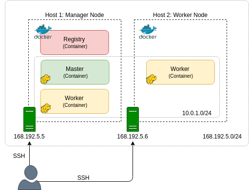

# Hadoop на Docker. Часть 1: Введение

Усовик С.В. (usovik@mirea.ru)

## Действия

- создание базового образа для дистрибутива Hadoop ([Часть. 2](hadoop_docker_part_2.md))

- создание образов master и worker ([Часть. 3](hadoop_docker_part_3.md))

- запуск кластера Hadoop на одном хосте ([Часть. 4](hadoop_docker_part_4.md))

- развертывание кластера Hadoop на нескольких хостах с использованием режима Docker Swarm ([Часть. 5](hadoop_docker_part_5.md))

- использование компоновочного файла для развертывания Docker Swarm ([Часть. 6](hadoop_docker_part_6.md))

  

## Архитектура

<i>Рисунок 1. Архитектура кластера Hadoop</i>

<i>Рисунок 2. Образы Hadoop</i>

<i>Рисунок 3. Контейнеры Hadoop</i>

## Недостатки

Наиболее очевидными недостатками этой архитектуры являются

- несколько демонов, работающих в одном контейнере;
- все главные демоны находятся в одном контейнере на одном хосте;
- `Namenode` и`SecondaryNamenode` совместно используют хост;
- нет HA для `Namenode` и `ResourceManager`.
