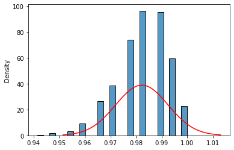
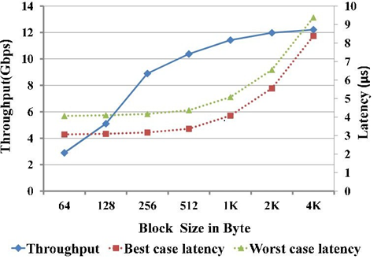

## Анализ моделей

Усовик С.В. (usovik@mirea.ru)

## Содержание
- [Требования](#требования)
- [Задачи анализа моделей](#задачи-анализа-моделей)
- [Форма финального отчета по модели](#форма-финального-отчета-по-модели)
- [Доверительный интервал](#доверительный-интервал)
- [Анализ ошибок](#анализ-ошибок)
- [Измерение и увеличение скорости предсказания](#измерение-и-увеличение-скорости-предсказания)
- [Рекомендации](#рекомендации)

## Требования
Для работы необходима установка следующего ПО:
- Python 3+
- Jupyter

## Задачи анализа моделей

При анализе моделей необходимо решить следующие задачи:

1. Определить цели анализа модели
2. Сформировать финальный отчет по модели
3. Какие приемы ускорения предсказаний можно использовать 

## Форма финального отчета по модели

Перед дальнейшим использованием модели (например выводом ее в продуктовый контур) необходимо ее описать или составить финальный отчет по модели. Форма финального отчета не регламентирована, но, как правило, содержит следующие разделы:

- характеристики обучающей выборки
- метрики качества на контрольной выборке
    - желательно с доверительными интервалами
- примеры ошибок модели с пояснениями
- соответствие нефункциональным требованиям
    - объем потребляемой RAM
    - размер файла с артефактом
    - время десериализации
    - пропускная способность
        - в зависимости от размера пакета
- можно использовать MLFlow для логирования данных отчета

## Доверительный интервал

При выборе моделей необходимо проводить сравнение их метрик качества. Метрики качества являются случайными величинами и зависят от входных данных и гиперпараметров. Для того, чтобы корректно сравнивать метрики модели, необходимо определить доверительный интервал метрик существующей модели и посмотреть не попадает ли в него метрика новой модели. Если не попадает, то этот результат можно рассматривать как статистически значимый.
При построении доверительного интервала следует руководствоваться следующим:

- по контрольной выборке можно построить Доверительный интервал для метрики качества
- при большом объеме выборки выгодно использовать метод bootstrap
- во многих случаях распределение будет подчиняться нормальному закону
- это позволит использовать параметрическую гипотезу для оценки доверительного интервалами

В [notebook](../notebooks/metrics_ci.ipynb) приведен пример получения доверительного интервала для метрик модели на примере задачи классификации.
Особенностью примера является то, что выборка не является отбалансированной по классам. При решении задачи строится конвейер преобразований:

```
clf = Pipeline([
    ("scaler", StandardScaler()),
    ("classifier", LogisticRegression()),
]).fit(X_train, y_train)
```

При невозможности получения других наблюдений в условиях дисбаланса классов пименяется метод bootstrap. Этот метод генерирует новую выборку из имеющейся, которая содержит те же даннные, но возможны повторы и, следовательно, разный баланс классов. Для каждой итерации bootstrap вычисляются метрики качества. Блок операторов, выполняющий bootstrap, приведен ниже:

```
bootstrap_iterations = 1000

acc_scores = np.zeros(bootstrap_iterations)
roc_auc_scores = np.zeros(bootstrap_iterations)

df = pd.DataFrame({
    "y_true": y_test,
    "y_pred": y_pred,
    "y_pred_proba": y_pred_proba,
})
for i in range(bootstrap_iterations):
    sample = df.sample(frac=1.0, replace=True)
    acc_scores[i] = accuracy_score(sample.y_true, sample.y_pred)
    roc_auc_scores[i] = roc_auc_score(sample.y_true, sample.y_pred_proba)
```
Построим гистограмму и аппроксимирующую плотность распределения вероятностей метрик качества полученной модели.

```
from scipy.stats import norm

acc_mean = acc_scores.mean()
acc_std = acc_scores.std()

acc_low = acc_mean - 3*acc_std
acc_upp = acc_mean + 3*acc_std

ax = sns.histplot(
    acc_scores,
    stat="density"
)
x = np.linspace(acc_low, acc_upp, 100)
ax.plot(x, norm.pdf(x, loc=acc_mean, scale=acc_std), color="red");
```


При построении новой модели или получении новой порции данных метрики качества сравниваются с доверительным интервалом. Если они за него выходят, то можно говорить о статистической значимости нового результата.

## Анализ ошибок

При валидации модели возникают ошибки, анализ которых надо производить. При анализе ошибок необходимо производить слдующее:
- выделить объекты контрольной выборки, на которых модель допустила ошибки
- выбрать несколько ошибочных примеров для ручного анализа
    - можно случайно
    - можно кластеризовать ошибки
- провести детальный анализ предсказания модели на этих примерах
    - использовать интерпретируемые модели
    - найти близкие примеры в пространстве признаков из обучающей выборки
- проверить разметку с помощью экспертов (может быть это ошибки в разметке)

Важную роль играет интерпретируемость модели и ошибок. Существуют инструменты, помогающие интерпретировать модели и данные:
- [SHAP](https://shap.readthedocs.io/en/latest/index.html) с [описанием](https://towardsdatascience.com/using-shap-values-to-explain-how-your-machine-learning-model-works-732b3f40e137)

## Измерение и увеличение скорости предсказания

Время предсказания - это случайная величина
    - для правильной оценки нужно провести несколько итераций
    - обычно оценивают старшие квантили распределения
Время предсказания зависит от размера пачки объектов на входе



В [notebook](../notebooks/benchmarks.ipynb) приведен пример установления зависимости скорости предсказания от размера входных данных.

Способы ускорения предсказания
- более простые модели
    - в том числе нейросети с меньшим числом параметров
        - например в huggingface для некоторых моделей есть вариации (xsmall, small, base,  large, xlarge)
- пакетная обработка
- исключение python из цепочки обработки данных (TensorRT, С++, etc)
- использование GPU

## Рекомендации
