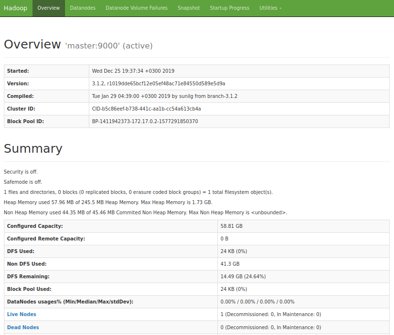

# Hadoop на Docker. Часть 2: Создание базового образа Hadoop

Усовик С.В. (usovik@mirea.ru)

## Содержание

- Установка Docker
- Создание базового образа Hadoop
  - Сборка на Ubuntu
  - Сборка на  JDK Debian
  - Сборка на JDK Alpine
  - Сравнение
- Очистка
- Рекомендации

## Установка Docker

Чтобы установить Docker Engine, следуйте [инструкциям](https://docs.docker.com/install/linux/docker-ce/ubuntu/) с официального сайта Docker ([link]) или изучите эту  [инструкцию](howto_install_docker.md).

## Создание базового образа Hadoop

Давайте соберем базовый образ Hadoop, который затем будет использоваться для создания master и worker образов Hadoop. Для этого создадим:
- `Dockerfile`, который содержит инструкции, описывающие, как создавать образы;
- Скрипт entrypoint, который будет запускаться при старте контейнера

Мы создадим три образа Hadoop на разных базовых образах:
- Ubuntu 14 (`ubuntu:14.04`)
- OpenJDK 8 на Debian (`openjdk:8-jdk-slim` на `openjdk:8-jre-slim`)
- OpenJDK 8 на Alpine (`openjdk:8-alpine` на `openjdk:8-jre-alpine`)

Последнюю реализацию на Alpine можно считать лучшей среди них.

### Сборка на Ubuntu

Это самый простой способ создать образ. Мы берем базовый образ Ubuntu и добавляем инструкции так же, как вы делаете это на хосте или виртуальной машине.

#### Dockerfile

- Установите OpenSHH и Java 8
- Создайте пользователя без полномочий root
- Загрузите дистрибутив Hadoop в виде архива и распакуйте его.
- Скопируйте подготовленные файлы конфигурации Hadoop
- Скопируйте скрипт entrypoint
- Выполните скрипт entrypoint

Dockerfile можно найти [здесь](../projects/docker/hadoop/base/ubuntu.Dockerfile).

```dockerfile
FROM ubuntu:14.04

LABEL maintainer="Sergei Usovik <usovik@mirea.ru>"


# ======================
#
# Install packages 
#
# ======================

RUN apt-get update && apt-get install -y openssh-server software-properties-common nano && \
    add-apt-repository ppa:openjdk-r/ppa && \
    apt update && apt -y install openjdk-8-jdk && \
    apt-get clean && rm -rf /var/lib/apt/lists/*


# ======================
#
# Create user
#
# ======================

# User home directory
ENV BASE_USER_DIR /home/bigdata

# Create user
RUN useradd -m -d $BASE_USER_DIR -s /bin/bash -p "$(openssl passwd -1 12345)" bigdata 

# Set current dir
WORKDIR /home/bigdata

# Add sudo permission for hadoop user to start ssh service
RUN echo "bigdata ALL=NOPASSWD:/usr/sbin/service ssh start" >> /etc/sudoers

# Copy the entrypoint script
COPY entrypoint.sh /usr/local/bin/
RUN chmod 755 /usr/local/bin/entrypoint.sh

# ======================
#
# Install Hadoop
#
# ======================

# Change root to the bigdata user
USER bigdata

# Install Hadoop
RUN mkdir hadoop && \
    wget -P /home/bigdata/sources https://archive.apache.org/dist/hadoop/common/hadoop-3.1.2/hadoop-3.1.2.tar.gz && \
    tar -xvf sources/hadoop-3.1.2.tar.gz --directory hadoop --strip-components 1 && \
    rm sources/hadoop-3.1.2.tar.gz

# Set Hadoop environment variables
ENV HADOOP_HOME $BASE_USER_DIR/hadoop
ENV HADOOP_CONF_DIR $HADOOP_HOME/etc/hadoop
ENV PATH $HADOOP_HOME/bin:$HADOOP_HOME:$PATH

# Copy hadoop configuration files
COPY --chown=bigdata:bigdata ["config/hdfs", "config/yarn", "config/mapreduce", "$HADOOP_CONF_DIR/"]

ENTRYPOINT ["sh", "/usr/local/bin/entrypoint.sh"]
```

#### Entrypoint

Файл entrypoint содержит сценарий bash, который запускает службу SSH и демоны Namenode и Datanode.

```bash
#!/bin/bash

# Create pivate and public keys
mkdir .ssh
ssh-keygen -t rsa -b 4096 -f .ssh/id_rsa -P ""
chmod 400 .ssh/id_rsa

# Format Namenode
hdfs namenode -format -force

# Start SSH Service
if [ -n "$1" ] && [ $1 == "alpine" ]; then
    echo "Start SSH on Alpine"
    sudo /usr/sbin/sshd -D &
else
    echo "Start SSH"
    sudo service ssh start
fi

# Start namenode and datanode
echo "Start namenode"
hdfs --daemon start namenode
echo "Start datanode"
hdfs --daemon start datanode

echo "The entrypoint script is completed"

tail -f /dev/null
```

#### Создание образов

Измените текущий каталог на тот, где находится Dockerfile:

`cd $YOUR_PATH/projects/docker/hadoop/base`

Создайте образ Hadoop, выполнив следующую команду:

`docker build -t hadoop-ubuntu-image -f ubuntu.Dockerfile .`

```
...
Successfully built 0a507c18d800
Successfully tagged hadoop-ubuntu-image:latest
```

Показать все образы, которые у вас есть:

`docker image ls`

```
REPOSITORY            TAG                 IMAGE ID            CREATED             SIZE
hadoop-ubuntu-image   latest              0a507c18d800        11 seconds ago      1.39GB
ubuntu                14.04               6e4f1fe62ff1        6 days ago          197MB
```

Теперь запустите контейнер с созданным образом Hadoop:

`docker run --name hadoop-ubuntu -it -d -p 9870:9870 -h master hadoop-ubuntu-image`

```
fced3d970a5ed60c289934d90fba74f8483a7865e69bac6f7ff85e3b054668e5
```

Получите логи из вашего контейнера:

`docker container logs hadoop-ubuntu`

```bash
...
Start SSH
 * Starting OpenBSD Secure Shell server sshd                             [ OK ] 
Start namenode
Start datanode
The entrypoint script is completed
```

Распечатайте отчет HDFS:

`docker exec hadoop-ubuntu bash hdfs dfsadmin -report`

```
Configured Capacity: 63142932480 (58.81 GB)
Present Capacity: 15553019904 (14.48 GB)
DFS Remaining: 15552995328 (14.48 GB)
DFS Used: 24576 (24 KB)
DFS Used%: 0.00%
Replicated Blocks:
        Under replicated blocks: 0
        Blocks with corrupt replicas: 0
        Missing blocks: 0
        Missing blocks (with replication factor 1): 0
        Low redundancy blocks with highest priority to recover: 0
        Pending deletion blocks: 0
Erasure Coded Block Groups: 
        Low redundancy block groups: 0
        Block groups with corrupt internal blocks: 0
        Missing block groups: 0
        Low redundancy blocks with highest priority to recover: 0
        Pending deletion blocks: 0

-------------------------------------------------
Live datanodes (1):

Name: 172.17.0.2:9866 (master)
Hostname: master
Decommission Status : Normal
Configured Capacity: 63142932480 (58.81 GB)
DFS Used: 24576 (24 KB)
Non DFS Used: 44352016384 (41.31 GB)
DFS Remaining: 15552995328 (14.48 GB)
DFS Used%: 0.00%
DFS Remaining%: 24.63%
Configured Cache Capacity: 0 (0 B)
Cache Used: 0 (0 B)
Cache Remaining: 0 (0 B)
Cache Used%: 100.00%
Cache Remaining%: 0.00%
Xceivers: 1
Last contact: Wed Dec 25 16:38:05 UTC 2019
Last Block Report: Wed Dec 25 16:37:38 UTC 2019
Num of Blocks: 0
```

Вы можете запустить интерактивную среду, выполнив следующую команду:

`docker exec -it hadoop-ubuntu bash`

```
bigdata@master:~$ ps -aux
USER       PID %CPU %MEM    VSZ   RSS TTY      STAT START   TIME COMMAND
bigdata      1  0.2  0.0   4452  1512 pts/0    Ss+  17:15   0:00 sh /usr/local/bin/entrypoint.sh
root        94  0.0  0.0  61388  3056 ?        Ss   17:15   0:00 /usr/sbin/sshd
bigdata    135  8.0  2.8 3860840 230436 pts/0  Sl+  17:15   0:10 /usr/lib/jvm/java-8-openjdk-amd64/bin/java -Dproc_namenode...
bigdata    196  6.5  2.3 3846844 189744 pts/0  Sl+  17:15   0:08 /usr/lib/jvm/java-8-openjdk-amd64/bin/java -Dproc_datanode...
bigdata    229  0.3  0.0  18188  3316 pts/1    Ss   17:15   0:00 bash
bigdata    247  0.0  0.0   4388   772 pts/0    S+   17:15   0:00 tail -f /dev/null
bigdata    336  0.0  0.0  15576  2124 pts/1    R+   17:17   0:00 ps -aux
bigdata@master:~$ exit
```

`localhost:9870`


<center><i>Рисунок 1. Namenode Web UI</i></center>


<center><i>Рисунок 2. Список Datanodes</i></center>

#### Очистка 

Остановите работающий контейнер:

`docker container stop hadoop-ubuntu`

```
hadoop-ubuntu
```

Удалите контейнер:

`docker container rm hadoop-ubuntu`

```
hadoop-ubuntu
```

### Сборка на JDK Debian

Чтобы сделать образ более легким, давайте заменим основу `ubuntu` на `openjdk:8-jdk-slim`, который содержит `java 8` поверх `debian`.

#### Dockerfile

```dockerfile
# Set global arguments for user home and hadoop dirs
ARG USER_HOME_ARG=/home/bigdata
ARG HADOOP_HOME_ARG=$USER_HOME_ARG/hadoop

# ======================
#
# Builder Stage
#
# ======================

FROM openjdk:8-jdk-slim AS builder

LABEL maintainer="Sergei Usovik <usovik@mirea.ru>"

ARG USER_HOME_ARG
ARG HADOOP_HOME_ARG
ARG HADOOP_VERSION=3.1.2
ARG HADOOP_URL=https://archive.apache.org/dist/hadoop/common

# Set current dir
WORKDIR $USER_HOME_ARG

RUN apt update && apt install -y wget && \
    apt-get clean && rm -rf /var/lib/apt/lists/*

# Install hadoop
RUN mkdir hadoop && \
    wget -P sources $HADOOP_URL/hadoop-$HADOOP_VERSION/hadoop-$HADOOP_VERSION.tar.gz && \
    tar -xvf sources/hadoop-$HADOOP_VERSION.tar.gz --directory hadoop --strip-components 1 && \
    rm sources/hadoop-$HADOOP_VERSION.tar.gz

# Copy hadoop configuration files
COPY ["config/hdfs", "config/yarn", "config/mapreduce", "$HADOOP_HOME_ARG/etc/hadoop/"]

# ======================
#
# Final Stage
#
# ======================

FROM openjdk:8-jre-slim 

ARG USER_HOME_ARG
ARG HADOOP_HOME_ARG

RUN apt update && apt install -y openssh-server sudo tini && \
    apt-get clean && rm -rf /var/lib/apt/lists/*

RUN \
    # Create a user named bigdata
    useradd -m -d $USER_HOME_ARG -s /bin/bash -p "$(openssl passwd -1 12345)" bigdata && \
    # Add sudo permission for hadoop user to start ssh service
    echo "bigdata ALL=NOPASSWD:/usr/sbin/service ssh start" >> /etc/sudoers

# Set Hadoop environment variables
ENV HADOOP_HOME $HADOOP_HOME_ARG
ENV HADOOP_CONF_DIR $HADOOP_HOME/etc/hadoop
ENV PATH $HADOOP_HOME/bin:$HADOOP_HOME:$PATH

# Copy hadoop from the builder stage
COPY --from=builder --chown=bigdata:bigdata $HADOOP_HOME $HADOOP_HOME

# Append a java home directory
RUN echo "\nexport JAVA_HOME=/usr/local/openjdk-8" >> $HADOOP_CONF_DIR/hadoop-env.sh

COPY entrypoint.sh /usr/local/bin/
RUN chmod 755 /usr/local/bin/entrypoint.sh

# Set current dir
WORKDIR $USER_HOME_ARG

# change root to the bigdata user
USER bigdata

ENTRYPOINT ["tini", "--", "/usr/local/bin/entrypoint.sh"]
```

#### Entrypoint

Файл Entrypoint здесь такой же, как и в предыдущем случае.

#### Создание образа

Перейдите в рабочий каталог:

`cd projects/docker/hadoop/base/`

И запустите сборку образа:

`docker build -t hadoop-debian-image -f jdk-debian.Dockerfile .`

```
...
Successfully built f6a3254987b8
Successfully tagged hadoop-debian-image:latest
```

Показать образы:

`docker image ls`

```
REPOSITORY            TAG                 IMAGE ID            CREATED             SIZE
hadoop-debian-image   latest              4473b2c0eb65        17 seconds ago      1.05GB
hadoop-ubuntu-image   latest              0a507c18d800        30 minutes ago      1.39GB
```

Запустите контейнер с созданным образом:

`docker run --name hadoop-debian -it -d -p 9870:9870 -h master hadoop-debian-image`

```
cb03b1a85986f10aa6832ff90a37e4097d7fa3a55ee421f4bb5a57f2bdd2293f
```

Проверьте журналы, связанные с запущенным контейнером:

`docker container logs hadoop-debian`

```bash
Start SSH
[ ok ] Starting OpenBSD Secure Shell server: sshd.
Start namenode
Start datanode
The entrypoint script is completed
```

Распечатайте отчет HDFS:

`docker exec hadoop-debian bash hdfs dfsadmin -report`

```
Configured Capacity: 63142932480 (58.81 GB)
Present Capacity: 12808126464 (11.93 GB)
DFS Remaining: 12808101888 (11.93 GB)
DFS Used: 24576 (24 KB)
DFS Used%: 0.00%
Replicated Blocks:
        Under replicated blocks: 0
        Blocks with corrupt replicas: 0
        Missing blocks: 0
        Missing blocks (with replication factor 1): 0
        Low redundancy blocks with highest priority to recover: 0
        Pending deletion blocks: 0
Erasure Coded Block Groups: 
        Low redundancy block groups: 0
        Block groups with corrupt internal blocks: 0
        Missing block groups: 0
        Low redundancy blocks with highest priority to recover: 0
        Pending deletion blocks: 0

-------------------------------------------------
Live datanodes (1):

Name: 172.17.0.2:9866 (master)
Hostname: master
Decommission Status : Normal
Configured Capacity: 63142932480 (58.81 GB)
DFS Used: 24576 (24 KB)
Non DFS Used: 47096909824 (43.86 GB)
DFS Remaining: 12808101888 (11.93 GB)
DFS Used%: 0.00%
DFS Remaining%: 20.28%
Configured Cache Capacity: 0 (0 B)
Cache Used: 0 (0 B)
Cache Remaining: 0 (0 B)
Cache Used%: 100.00%
Cache Remaining%: 0.00%
Xceivers: 1
Last contact: Wed Dec 25 17:08:59 UTC 2019
Last Block Report: Wed Dec 25 17:08:59 UTC 2019
Num of Blocks: 0
```


`docker exec -it hadoop-debian bash`

```
bigdata@master:~$ pstree -a
tini,1 -- /usr/local/bin/entrypoint.sh
  ├─entrypoint.sh,6 /usr/local/bin/entrypoint.sh
  │   └─tail,197 -f /dev/null
  ├─java,113 -Dproc_namenode...
  ├─java,173 -Dproc_datanode...
  └─sshd,69
```

#### Очистка 

Остановите работающий контейнер:

`docker container stop hadoop-debian`

```
hadoop-debian
```

Удалите контейнер:

`docker container rm hadoop-debian`

```
hadoop-debian
```

### Сборка на JDK Alpine

#### Dockerfile

Давайте составим

```dockerfile
# Set global arguments for user home and hadoop dirs
ARG USER_HOME_ARG=/home/bigdata
ARG HADOOP_HOME_ARG=$USER_HOME_ARG/hadoop

# ======================
#
# Builder Stage
#
# ======================

FROM openjdk:8-alpine AS builder

LABEL maintainer="Sergei Usovik <usovik@mirea.ru>"

ARG USER_HOME_ARG
ARG HADOOP_HOME_ARG
ARG HADOOP_VERSION=3.1.2
ARG HADOOP_URL=https://archive.apache.org/dist/hadoop/common

# Set current dir
WORKDIR $USER_HOME_ARG

RUN apk upgrade --no-cache && \
    apk add --no-cache bash wget && \
    rm /bin/sh && ln -sv /bin/bash /bin/sh

# Install hadoop
RUN mkdir hadoop && \
    wget -P sources $HADOOP_URL/hadoop-$HADOOP_VERSION/hadoop-$HADOOP_VERSION.tar.gz && \
    tar -xvf sources/hadoop-$HADOOP_VERSION.tar.gz --directory hadoop --strip-components 1 && \
    rm sources/hadoop-$HADOOP_VERSION.tar.gz

# Copy hadoop configuration files
COPY ["config/hdfs", "config/yarn", "config/mapreduce", "$HADOOP_HOME_ARG/etc/hadoop/"]


# ======================
#
# Final Stage
#
# ======================

FROM openjdk:8-alpine 

ARG USER_HOME_ARG
ARG HADOOP_HOME_ARG

RUN apk upgrade --no-cache && \
    apk add --no-cache bash wget sudo tini openssh && \
    rm /bin/sh && ln -sv /bin/bash /bin/sh

# Set Hadoop environment variables
ENV HADOOP_HOME $HADOOP_HOME_ARG
ENV HADOOP_CONF_DIR $HADOOP_HOME/etc/hadoop
ENV PATH $HADOOP_HOME/bin:$HADOOP_HOME:$PATH

RUN \
    # Create user
    addgroup bigdata && \
    adduser --ingroup bigdata -h $USER_HOME_ARG --shell /bin/bash --disabled-password bigdata && \
    echo "bigdata:12345" | chpasswd && \
    # Append sudo permission for hadoop user to start ssh service
    echo "bigdata ALL=NOPASSWD:/usr/sbin/sshd -D" >> /etc/sudoers \
    # Replace a comment line with the actual path of the host private key in sshd_config
    sed -ir 's/#HostKey \/etc\/ssh\/ssh_host_rsa_key/HostKey \/etc\/ssh\/id_rsa/g' /etc/ssh/sshd_config

# Replace a java home directory in hadoop-env.sh
#RUN sed -ir 's/JAVA_HOME=\/usr\/lib\/jvm\/java-8-openjdk-amd64/JAVA_HOME=\/usr\/lib\/jvm\/java-1.8-openjdk/g' $HADOOP_CONF_DIR/hadoop-env.sh

# Copy hadoop from the builder stage
COPY --from=builder --chown=bigdata:bigdata $HADOOP_HOME $HADOOP_HOME

# Append a java home directory
RUN echo "/nexport JAVA_HOME=/usr/lib/jvm/java-1.8-openjdk" >> $HADOOP_CONF_DIR/hadoop-env.sh

# Set current dir
WORKDIR $USER_HOME_ARG

# Copy the starting script
COPY entrypoint.sh /usr/local/bin/
RUN chmod 755 /usr/local/bin/entrypoint.sh


# Change root to the bigdata user
USER bigdata

ENTRYPOINT ["tini", "--", "/usr/local/bin/entrypoint.sh"]
CMD ["alpine"]
```

#### Entrypoint

Здесь entrypoint, что и в предыдущем случае.

#### Создание образа

Если это еще не сделано, измените текущий каталог на следующий:

`cd projects/docker/hadoop/base/`

Сборка образа:

`docker build -t hadoop-alpine-image -f jdk-alpine.Dockerfile .`

```
...
Successfully built 2e973edc96c6
Successfully tagged hadoop-alpine-image:latest
```

Показать образы, созданные ранее:

`docker image ls`

```
REPOSITORY            TAG                 IMAGE ID            CREATED             SIZE
hadoop-alpine-image   latest              2e973edc96c6        32 seconds ago      969MB
hadoop-debian-image   latest              4473b2c0eb65        32 minutes ago      1.05GB
hadoop-ubuntu-image   latest              0a507c18d800        About an hour ago   1.39GB
```

Запустите container:

`docker run --name hadoop-alpine -it -d -p 9870:9870 -h master hadoop-alpine-image`

```
cabef9cdb2e23bdbc250621068077099c496d1389dfdf48db0df1cd51a0c1708
```

Посмотрим логи:

`docker container logs hadoop-alpine`

```bash
Start SSH on Alpine
Start namenode
Start datanode
The entrypoint script is completed
```

Распечатайте отчет HDFS:

`docker exec hadoop-alpine bash hdfs dfsadmin -report`

```
Configured Capacity: 0 (0 B)
Present Capacity: 0 (0 B)
DFS Remaining: 0 (0 B)
DFS Used: 0 (0 B)
DFS Used%: 0.00%
Replicated Blocks:
        Under replicated blocks: 0
        Blocks with corrupt replicas: 0
        Missing blocks: 0
        Missing blocks (with replication factor 1): 0
        Low redundancy blocks with highest priority to recover: 0
        Pending deletion blocks: 0
Erasure Coded Block Groups: 
        Low redundancy block groups: 0
        Block groups with corrupt internal blocks: 0
        Missing block groups: 0
        Low redundancy blocks with highest priority to recover: 0
        Pending deletion blocks: 0

-------------------------------------------------
```

Нерешенная проблема:

```
FIXME: 
Strange behavior: there were no datanodes. 
Perhaps this is an alpine specific issue
```

#### Очистка

Остановить работающий контейнер:

`docker container stop hadoop-alpine`

```
hadoop-alpine
```

Удалите контейнер:

`docker container rm hadoop-alpine`

```
hadoop-alpine
```

### Сравнение

`docker image ls`

```
REPOSITORY            TAG                 IMAGE ID            CREATED             SIZE
hadoop-alpine-image   latest              2e973edc96c6        32 seconds ago      969MB
hadoop-debian-image   latest              4473b2c0eb65        32 minutes ago      1.05GB
hadoop-ubuntu-image   latest              0a507c18d800        About an hour ago   1.39GB
```

## Рекомендации

```
TODO
```
