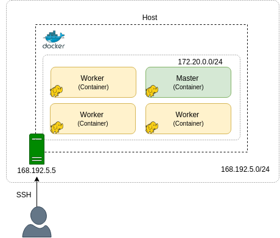

# Hadoop на Docker. Часть 4: Развертывание с помощью Docker Compose и запуск MapReduce-приложения

Усовик С.В. (usovik@mirea.ru)

## Содержание

- Архитектура
- Развертывание с помощью Docker Compose
- Запуск MapReduce-приложения
- Рекомендации

## Предыдущие шаги

- [Part 1: Введение](hadoop_docker_part_1.md)
- [Part 2: Создание базового образа Hadoop](hadoop_docker_part_2.md)
- [Part 3: Создание образов Hadoop Master и Worker](hadoop_docker_part_3.md)


## Архитектура

<center>



<i>Рисунок 1. Hadoop кластер на единственном хосте</i>
</center>


## Развертывание при помощи Docker Compose

Установите рабочий каталог следующим образом:

`cd $YOUR_PATH/projects/docker/hadoop/`

#### Создание образов

Если вы еще не создали базовый образ, выполните следующую команду:

`docker build -t hadoop-base-image -f ./base/jdk-debian.Dockerfile ./base`

#### Docker Compose файл

Обратите внимание, что этот файл (`docker-compose.yml`) должен находиться в рабочем каталоге.

```yml
version: "3.7"

services:
  master:     # Master Node
    image: hadoop-master-image
    build:
      context: .
      dockerfile: ./master/Dockerfile
    ports:
      - "9870:9870"     # Namenode
      - "8088:8088"     # Resource Manager
      - "19888:19888"   # History Server
    container_name: master
    volumes: 
      - ./app:/home/bigdata/app     # jar files
      - ./data:/home/bigdata/data   # data to copy to HDFS
    networks:
      - hd-network

  worker:     # Worker Node
    image: hadoop-worker-image
    build:
      context: .
      dockerfile: ./worker/Dockerfile
    networks:
      - hd-network

networks:
  hd-network: # Network
    driver: bridge
    ipam:
      config:
      - subnet:  172.20.0.0/24
```

#### Развертывание кластера Hadoop

Выполните следующую команду, чтобы развернуть master и 4 workers:

`docker-compose up -d --scale worker=4`

```
Creating network "hadoop_default" with the default driver
Creating master          ... done
Creating hadoop_worker_1 ... done
Creating hadoop_worker_2 ... done
Creating hadoop_worker_3 ... done
Creating hadoop_worker_4 ... done
```

Проверьте logs контейнеров:

`docker container logs master`

```
Start SSH service
 * Starting OpenBSD Secure Shell server sshd
   ...done.
Start Hadoop daemons
Copy files to HDFS
The entrypoint script is completed
```

Копирование файлов в HDFS может занять некоторое время...

`docker container logs hadoop_worker_1`

```
Start SSH service
Starting OpenBSD Secure Shell server: sshd.
Start Hadoop daemons
WARNING: /home/bigdata/hadoop/logs does not exist. Creating.
```

#### Проверка демонов Hadoop

Показать работающие узлы данных в `HDFS`:

`docker exec master bash hdfs dfsadmin -printTopology`

```
Rack: /default-rack
   172.20.0.3:9866 (hadoop_worker_4.hadoop_hd-network)
   172.20.0.4:9866 (hadoop_worker_3.hadoop_hd-network)
   172.20.0.5:9866 (hadoop_worker_2.hadoop_hd-network)
   172.20.0.6:9866 (hadoop_worker_1.hadoop_hd-network)
```

Показать каталог `data`:

`docker exec master bash hdfs dfs -ls /data`

```
Found 2 items
-rw-r--r--   3 bigdata supergroup 1478965298 2019-12-25 19:04 /data/reviews.json
-rw-r--r--   3 bigdata supergroup      69053 2019-12-25 19:04 /data/samples_100.json
```

Запустите веб-браузер и перейдите на «localhost: 9870», чтобы отобразить веб-интерфейс HDFS.

<center>


<i>Рисунок 2. Таблица Datanodes</i></center>

Теперь покажите все  Nodemanagers вашего `YARN`:

`docker exec master bash yarn node --list`

```
INFO client.RMProxy: Connecting to ResourceManager at master/172.20.0.2:8032
Total Nodes:4
         Node-Id             Node-State Node-Http-Address       Number-of-Running-Containers
4976da71eefb:45454              RUNNING 4976da71eefb:8042                                  0
f90c3dbf6897:45454              RUNNING f90c3dbf6897:8042                                  0
4a254ab81921:45454              RUNNING 4a254ab81921:8042                                  0
0b6e6a123cf3:45454              RUNNING 0b6e6a123cf3:8042                                  0
```

Извлеките информацию об очереди `dev`:

`docker exec master bash yarn queue --status dev`

```
INFO client.RMProxy: Connecting to ResourceManager at master/172.20.0.2:8032
Queue Information : 
Queue Name : dev
        State : RUNNING
        Capacity : 80.0%
        Current Capacity : .0%
        Maximum Capacity : 100.0%
        Default Node Label expression : <DEFAULT_PARTITION>
        Accessible Node Labels : *
        Preemption : enabled
        Intra-queue Preemption : disabled
```

Перейдите на `localhost:8088` чтобы открыть веб-интерфейс YARN.

<center>


<i>Рисунок 3. YARN: Nodes</i></center>

## Запуск MapReduce-приложения


```
docker exec master bash \
    yarn jar app/average-rating-app-1.1.jar \
        -D mapreduce.job.reduces=2 \
        /data/reviews.json \
        /data/output/ratings/
```

```
...
INFO mapreduce.Job:  map 0% reduce 0%
INFO mapreduce.Job:  map 12% reduce 0%
INFO mapreduce.Job:  map 21% reduce 0%
INFO mapreduce.Job:  map 24% reduce 0%
INFO mapreduce.Job:  map 32% reduce 0%
INFO mapreduce.Job:  map 43% reduce 0%
INFO mapreduce.Job:  map 52% reduce 9%
INFO mapreduce.Job:  map 59% reduce 9%
INFO mapreduce.Job:  map 66% reduce 9%
INFO mapreduce.Job:  map 78% reduce 9%
INFO mapreduce.Job:  map 89% reduce 9%
INFO mapreduce.Job:  map 93% reduce 9%
INFO mapreduce.Job:  map 97% reduce 9%
INFO mapreduce.Job:  map 100% reduce 9%
INFO mapreduce.Job:  map 100% reduce 85%
INFO mapreduce.Job:  map 100% reduce 100%
...
```

`docker exec master bash yarn app -list`

```
INFO client.RMProxy: Connecting to ResourceManager at master/172.20.0.2:8032
Total number of applications (application-types: [], states: [SUBMITTED, ACCEPTED, RUNNING] and tags: []):1
                Application-Id      Application-Name        Application-Type          User           Queue                   State             Final-State             Progress                       Tracking-URL
application_1577348381181_0001      AverageRatingApp               MAPREDUCE       bigdata             dev                 RUNNING               UNDEFINED                  50%          http://cc47aa4c6c80:46177
```


`docker exec master bash yarn queue --status dev`

```
INFO client.RMProxy: Connecting to ResourceManager at master/172.20.0.2:8032
Queue Information : 
Queue Name : dev
        State : RUNNING
        Capacity : 80.0%
        Current Capacity : 26.0%
        Maximum Capacity : 100.0%
        Default Node Label expression : <DEFAULT_PARTITION>
        Accessible Node Labels : *
        Preemption : enabled
        Intra-queue Preemption : disabled
```

`docker exec master bash yarn app -status appId`

```
INFO client.RMProxy: Connecting to ResourceManager at master/172.20.0.2:8032
INFO conf.Configuration: resource-types.xml not found
INFO resource.ResourceUtils: Unable to find 'resource-types.xml'.
Application Report : 
        Application-Id : application_1577348381181_0001
        Application-Name : AverageRatingApp
        Application-Type : MAPREDUCE
        User : bigdata
        Queue : dev
        Application Priority : 0
        Start-Time : 1577348915297
        Finish-Time : 0
        Progress : 95%
        State : RUNNING
        Final-State : UNDEFINED
        Tracking-URL : http://cc47aa4c6c80:46177
        RPC Port : 45063
        AM Host : cc47aa4c6c80
        Aggregate Resource Allocation : 2532605 MB-seconds, 3775 vcore-seconds
        Aggregate Resource Preempted : 0 MB-seconds, 0 vcore-seconds
        Log Aggregation Status : DISABLED
        Diagnostics : 
        Unmanaged Application : false
        Application Node Label Expression : <Not set>
        AM container Node Label Expression : <DEFAULT_PARTITION>
        TimeoutType : LIFETIME  ExpiryTime : UNLIMITED  RemainingTime : -1seconds
```

<center>


<i>Рисунок 4. Приложения</i></center>


<center>


<i>Рисунок 5. YARN очереди</i></center>


<center>


<i>Рисуно 6. MapReduce Job</i></center>


`docker exec master bash hdfs dfs -ls /data/output/ratings`

```
Found 3 items
-rw-r--r--   3 bigdata supergroup          0 2019-12-26 08:32 /data/output/ratings/_SUCCESS
-rw-r--r--   3 bigdata supergroup     741683 2019-12-26 08:32 /data/output/ratings/part-r-00000
-rw-r--r--   3 bigdata supergroup     742080 2019-12-26 08:32 /data/output/ratings/part-r-00001
```

`docker exec master bash hdfs dfs -head /data/output/ratings/part-r-00000`

```
0528881469      2.4
0594451647      4.2
0594481813      4.0
0972683275      4.461187214611872
1400501466      3.953488372093023
1400501776      4.15
1400532620      3.6097560975609757
...
```

<center>


<i>Рисунок 7. Выходная директория</i></center>

## Очистка

Остановите контейнеры:

`docker-compose stop`

```
Stopping hadoop_worker_2 ... done
Stopping hadoop_worker_4 ... done
Stopping hadoop_worker_1 ... done
Stopping hadoop_worker_3 ... done
Stopping master          ... done
```

Остановите (если работаете) и удалите свои контейнеры и сеть

`docker-compose down`

```
Stopping hadoop_worker_1 ... done
Stopping hadoop_worker_4 ... done
Stopping hadoop_worker_3 ... done
Stopping hadoop_worker_2 ... done
Stopping master          ... done
Removing hadoop_worker_1 ... done
Removing hadoop_worker_4 ... done
Removing hadoop_worker_3 ... done
Removing hadoop_worker_2 ... done
Removing master          ... done
Removing network hadoop_default
```

Обратите внимание, что при удалении контейнеров все данные в HDFS будут потеряны.

## Рекомендации

- [Compose file version 3 reference](https://docs.docker.com/compose/compose-file/)
- [HDFS Commands](https://hadoop.apache.org/docs/r3.1.2/hadoop-project-dist/hadoop-common/FileSystemShell.html)
- [YARN Commands](https://hadoop.apache.org/docs/r3.1.2/hadoop-yarn/hadoop-yarn-site/YarnCommands.html)
