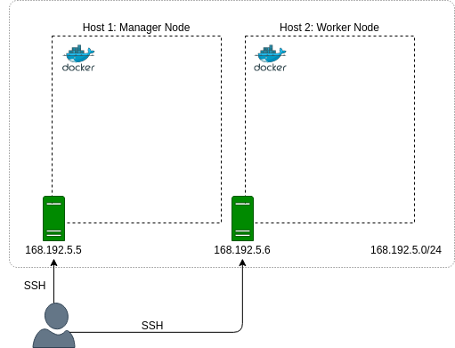
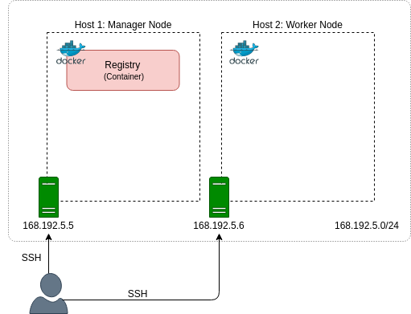

# Hadoop на Docker. Часть 5: Развертывание на нескольких хостах в режиме Docker Swarm

Усовик С.В. (usovik@mirea.ru)


## Содержание

- Включение режима Swarm
- Создание службы Private Registry Service
- Создание службы Hadoop Services
- Запуск MapReduce-приложения
- Очистка
- Рекомендации


## Предпосылки

- 2 узла (физических или виртуальных) с Docker Engine в одной сети
- Каждый узел должен иметь как минимум 2 виртуальных процессора и 4G памяти.
- Образы Hadoop Master и Worker (смотри [Часть 3](hadoop_docker_part_3.md))

## Предыдущие шаги

- [Часть 1: Введение](hadoop_docker_part_1.md)
- [Часть 2: Создание базового образа Hadoop](hadoop_docker_part_2.md)
- [Часть 3: Создание образов Hadoop Master и Worker](hadoop_docker_part_3.md)
- [Часть 4: Развертывание при помощи Docker Compose и запуск MapReduce-приложения](hadoop_docker_part_4.md)


## Включение режима Swarm

Чтобы активировать Swarm Mode, вы должны инициализировать один из ваших хостов в качестве узла менеджера. На разных хостах может быть один или несколько менеджеров. После этого присоединитесь к другому хосту в качестве рабочего, выполнив команду `join`.

В этом уроке мы будем использовать одиночные управляющие и рабочие узлы, как показано ниже.

<center>



<i>Рисунок 1. Two-node Swarm кластер</i>
</center>

#### Создание manager node

Инициализируйте swarm на manager node:

```
docker swarm init \
    --advertise-addr 192.168.5.5
```

```
Swarm initialized: current node (z86fwa4upl7lseecqlap3imlb) is now a manager.

To add a worker to this swarm, run the following command:

    docker swarm join --token SWMTKN-1-2l1ln3qg7d3i3dse67lnkcoojkh1zixkgy53st0h8s4m98eze0-9dt3zhk48rlvhkzu3ot1lke4l 192.168.5.5:2377

To add a manager to this swarm, run 'docker swarm join-token manager' and follow the instructions.
```

Выходные данные команды содержат рабочий токен присоединения. Этот токен необходим для привязки других узлов к рою в качестве рабочих. Вы можете распечатать его, выполнив следующую команду:

`docker swarm join-token worker`

Показать все узлы роя:

`docker node ls`

```
ID                            HOSTNAME            STATUS              AVAILABILITY        MANAGER STATUS      ENGINE VERSION
z86fwa4upl7lseecqlap3imlb *   vhost-1             Ready               Active              Leader              19.03.5
```

#### Создание worker node

На рабочем узле выполните следующую команду, чтобы присоединить узел к рою:

```
docker swarm join \
    --token SWMTKN-1-2l1ln3qg7d3i3dse67lnkcoojkh1zixkgy53st0h8s4m98eze0-9dt3zhk48rlvhkzu3ot1lke4l \
    --advertise-addr enp0s3 \
    192.168.5.5:2377
```


```
This node joined a swarm as a worker.
```

Теперь на узле manager отобразите все узлы:

`docker node ls`

```
ID                            HOSTNAME            STATUS              AVAILABILITY        MANAGER STATUS      ENGINE VERSION
z86fwa4upl7lseecqlap3imlb *   vhost-1             Ready               Active              Leader              19.03.5
jqz1ctzdzugt6s6i8c45qw08z     vhost-2             Ready               Active                                  19.03.5
```

Обратите внимание, что эта команда работает только в manager.

Отображение текущего состояния роя:

`docker info`

```
...
 Swarm: active
  NodeID: z86fwa4upl7lseecqlap3imlb
  Is Manager: true
  ClusterID: p2nq1duiyegtnr6dvwptfn0jq
  Managers: 1
  Nodes: 2
  Default Address Pool: 10.0.0.0/8  
  SubnetSize: 24
  Data Path Port: 4789
  Orchestration:
   Task History Retention Limit: 5
  Raft:
   Snapshot Interval: 10000
   Number of Old Snapshots to Retain: 0
   Heartbeat Tick: 1
   Election Tick: 10
  Dispatcher:
   Heartbeat Period: 5 seconds
  CA Configuration:
   Expiry Duration: 3 months
   Force Rotate: 0
  Autolock Managers: false
  Root Rotation In Progress: false
  Node Address: 192.168.5.5
  Manager Addresses:
   192.168.5.5:2377
...
```

## Создание службы Private Registry Service

Как сказано в официальном документе:

> Реестр — это высоко масштабируемое серверное приложение без сохранения состояния, которое хранит и позволяет вам распространять образы Docker.

Все узлы в кластере должны иметь возможность извлекать образы для развертывания сервисов. Для этого вы можете использовать Docker Hub, Docker Trusted Registry или создать свой частный реестр.

Чтобы развернуть частный реестр, выполните следующие действия:

- Создать самоподписанный сертификат 
- Скопируйте публичный сертификат в рабочий
- Развернуть службу реестра
- Отправка образов Hadoop в реестр

<center>



<i>Рисунок 2. Private Registry как служба</i>
</center>

#### Создание самоподписного сертификата

В вашем рабочем каталоге `$YOUR_PATH/projects/docker/hadoop` создайте новый каталог с именем `certs`, который будет использоваться для хранения сертификатов, а затем мы подключим его к службе реестра:

`mkdir -p certs`

Чтобы использовать IP-адрес вместо имени хоста в качестве префикса репозитория, добавьте следующую строку в `/etc/ssl/openssl.cnf`:

```
subjectAltName=IP:192.168.5.5 # your manager node ip
```

Теперь создайте свой сертификат на узле менеджера:

```
openssl req \
  -newkey rsa:4096 -nodes -sha256 -keyout certs/domain.key \
  -x509 -days 365 -out certs/domain.crt
```

#### Копирование публичного сертификата в рабочий

Скопируйте общедоступную часть `domain.crt` в `/etc/docker/certs.d/192.168.5.5:5000`:

`sudo mkdir -p /etc/docker/certs.d/192.168.5.5:5000 && sudo cp certs/domain.crt $_`

Скопируйте `domain.crt` на рабочий узел. Во-первых, создайте каталог:

`ssh -t bigdata@192.168.5.6 "sudo mkdir -p /etc/docker/certs.d/192.168.5.5:5000 && sudo chown -R bigdata:bigdata /etc/docker/certs.d/192.168.5.5:5000"`

А затем скопируйте файл:

`scp certs/domain.crt bigdata@192.168.5.6:/etc/docker/certs.d/192.168.5.5:5000`

```
bigdata@192.168.5.6's password: 
domain.crt                                                                                                                                    100% 1964     1.0MB/s   00:00
```

#### Поиск неисправностей

Выполните следующую команду, чтобы сгенерировать HTTPS-запрос к реестру:

`curl -v https://192.168.5.5:5000/`

Если вы получите ответ со статусом `200`, то все в порядке, ваш реестр работает как часы. Однако, если есть статус ошибки, попробуйте выполнить следующие шаги на обоих хостах:

`sudo cp certs/domain.crt /usr/local/share/ca-certificates/192.168.5.5.crt`

`sudo update-ca-certificates`

Если все еще не работает, попробуйте [ссылку](https://docs.docker.com/registry/insecure/). Возможно, вы найдете там что-то полезное

#### Развертывание службы реестра

Теперь пришло время запустить службу реестра. В диспетчере выполните следующую команду:

```
docker service create --name registry \
    --mount target=/certs,source="$(pwd)"/certs,type=bind \
    --mode replicated \
    --replicas 1 \
    -e REGISTRY_HTTP_ADDR=0.0.0.0:5000 \
    -e REGISTRY_HTTP_TLS_CERTIFICATE=/certs/domain.crt \
    -e REGISTRY_HTTP_TLS_KEY=/certs/domain.key \
    -p 5000:5000 \
    --constraint 'node.role == manager' \
    registry:2
```

```
u57qsxb1y278kttwqqbwudgbl
overall progress: 1 out of 1 tasks 
1/1: running   [==================================================>] 
verify: Service converged 
```

Распечатайте запущенные сервисы в терминале:

`docker service ls`

```
ID                  NAME                MODE                REPLICAS            IMAGE               PORTS
u57qsxb1y278        registry            replicated          1/1                 registry:2          *:5000->5000/tcp
```

#### Отправка образов Hadoop в реестр

В 3-й части урока мы создали два образа: `hadoop-master-image` и `hadoop-worker-image`. Таким образом, эти образы должны быть в вашем локальном репозитории (на узле manager). Если нет, посмотрите, как их создать [здесь](hadoop_docker_part_3.md).

Чтобы сделать образы доступными на нескольких хостах, мы должны пометить их префиксом нашего репозитория  `192.168.5.5:5000` и отправить их в реестр.

Чтобы пометить образы, выполните следующие команды:

`docker tag hadoop-master-image 192.168.5.5:5000/hadoop-master-image`

`docker tag hadoop-worker-image 192.168.5.5:5000/hadoop-worker-image`

Теперь вставьте в реестр `192.168.5.5:5000/hadoop-master-image` :

`docker push 192.168.5.5:5000/hadoop-master-image`

```
The push refers to repository [192.168.5.5:5000/hadoop-master-image]
c5017938b20e: Pushed 
922e6bdd6d66: Pushed 
624024164081: Pushed 
f259faf2354d: Pushed 
8d1f8522b26e: Pushed 
3d07e3f60663: Pushed 
fa44fd8460e9: Pushed 
438ee4e74576: Pushed 
34032783db35: Pushed 
7af1338539ab: Pushed 
72b49afd07bf: Pushed 
fbc3b2dba006: Pushed 
dfc3c372b2bb: Pushed 
831c5620387f: Pushed 
latest: digest: sha256:4a6904d313224b6a126b4d21b4fd2ede27b1d6aebbbcbc3d964fdfbcf19749d4 size: 3246
```

То же самое для второго образа:

`docker push 192.168.5.5:5000/hadoop-worker-image`

```
The push refers to repository [192.168.5.5:5000/hadoop-worker-image]
f8562304087d: Pushed 
79e0b523c15a: Pushed 
0b6e5bf87ed6: Pushed 
8d1f8522b26e: Mounted from hadoop-master-image 
3d07e3f60663: Mounted from hadoop-master-image 
fa44fd8460e9: Mounted from hadoop-master-image 
438ee4e74576: Mounted from hadoop-master-image 
34032783db35: Mounted from hadoop-master-image 
7af1338539ab: Mounted from hadoop-master-image 
72b49afd07bf: Mounted from hadoop-master-image 
fbc3b2dba006: Mounted from hadoop-master-image 
dfc3c372b2bb: Mounted from hadoop-master-image 
831c5620387f: Mounted from hadoop-master-image 
latest: digest: sha256:e63c3073c5e495ba0b2bc2f05da02af0585bd2c79ae2b289c0f379574aa7e758 size: 3037
```

Теперь ваши образы могут быть загружены разными хостами из вашего частного репозитория.

## Создание службы Hadoop Services

Чтобы запустить службы Hadoop, мы выполним следующие действия:

- Создайте пользовательскую оверлейную сеть
- Создание сервисов Hadoop
- Проверка запущенных сервисов
- Проверьте демоны Hadoop
- Службы масштабирования

Службы должны быть развернуты, как показано ниже.

<center>


<i>Рисунок 3. Службы Hadoop</i>
</center>


### Пользовательская оверлейная сеть

Оверлейная сеть — это сеть, распределенная по нескольким хостам. Когда вы инициализируете рой, оверлейная сеть `ingress` будет создана автоматически.

Чтобы создать собственную пользовательскую сеть, выполните следующую команду:

`docker network create -d overlay hadoop-network`

```
qbcx0qxqwjuis8vdd0iqiutoj
```

### Службы Hadoop Services

Давайте наложим следующие ограничения на основные и рабочие сервисы:

- master:
    - он должен быть на узле manager 
    - должен быть только один master
    - он должен открывать порты для веб-интерфейса

- worker:
    - должна быть одна реплика на узел

####  Создание службы Master Service

Создайте службу следующим образом:

```
docker service create \
    --name master \
    --hostname master \
    --mount target=/app,source="$(pwd)"/app,type=bind \
    --mount target=/data,source="$(pwd)"/data,type=bind \
    --network hadoop-network \
    --endpoint-mode dnsrr \
    --mode replicated \
    --replicas 1 \
    --publish published=9870,target=9870,mode=host \
    --publish published=8088,target=8088,mode=host \
    --publish published=19888,target=19888,mode=host \
    --constraint 'node.role == manager' \
    192.168.5.5:5000/hadoop-master-image
```

```
2k5h4cpr3eheqion88rbwwrw4
overall progress: 1 out of 1 tasks 
1/1: running   [==================================================>] 
verify: Service converged 
```

#### Создание службы Worker Service

Создайте службу следующим образом:

```
docker service create \
    --name worker \
    --network hadoop-network \
    --endpoint-mode dnsrr \
    --replicas 2 \
    --replicas-max-per-node 1 \
    192.168.5.5:5000/hadoop-worker-image
```

```
uiu4bwmoakzuwaol8cj83yvt7
overall progress: 2 out of 2 tasks 
1/2: running   [==================================================>] 
2/2: running   [==================================================>] 
verify: Service converged 
```

### Службы инспекции

Существует несколько объектов, связанных со службами, которые можно проверить, например:

- Сами службы
- Задачи, которые запускаются на основе определенной службы
- Контейнеры, являющиеся единицей выполнения задач
- Сеть

#### Службы

Показать все службы:

`docker service ls`

```
ID                  NAME                MODE                REPLICAS               IMAGE                                         PORTS
2k5h4cpr3ehe        master              replicated          1/1                    192.168.5.5:5000/hadoop-master-image:latest   
u57qsxb1y278        registry            replicated          1/1                    registry:2                                    *:5000->5000/tcp
uiu4bwmoakzu        worker              replicated          2/2 (max 1 per node)   192.168.5.5:5000/hadoop-worker-image:latest 
```

Например, чтобы узнать подробности о master службе, выполните следующую команду:

`docker service inspect master`

```
ID:             2k5h4cpr3eheqion88rbwwrw4
Name:           master
Service Mode:   Replicated
 Replicas:      1
Placement:
 Constraints:   [node.role == manager]
UpdateConfig:
 Parallelism:   1
 On failure:    pause
 Monitoring Period: 5s
 Max failure ratio: 0
 Update order:      stop-first
RollbackConfig:
 Parallelism:   1
 On failure:    pause
 Monitoring Period: 5s
 Max failure ratio: 0
 Rollback order:    stop-first
ContainerSpec:
 Image:         192.168.5.5:5000/hadoop-master-image:latest@sha256:4a6904d313224b6a126b4d21b4fd2ede27b1d6aebbbcbc3d964fdfbcf19749d4
 Init:          false
Mounts:
 Target:        /app
  Source:       /home/bigdata/docker/hadoop/app
  ReadOnly:     false
  Type:         bind
 Target:        /data
  Source:       /home/bigdata/docker/hadoop/data
  ReadOnly:     false
  Type:         bind
Resources:
Networks: hadoop-network 
Endpoint Mode:  dnsrr
Ports:
 PublishedPort = 9870
  Protocol = tcp
  TargetPort = 9870
  PublishMode = host
 PublishedPort = 8088
  Protocol = tcp
  TargetPort = 8088
  PublishMode = host
 PublishedPort = 19888
  Protocol = tcp
  TargetPort = 19888
  PublishMode = host 
```

#### Задачи

Чтобы отобразить все задачи, связанные с определенной службой, используйте команду `docker service ps` следующим образом:

`docker service ps master`

```
ID                  NAME                IMAGE                                         NODE                DESIRED STATE       CURRENT STATE                ERROR               PORTS
una5z7xy6jyc        master.1            192.168.5.5:5000/hadoop-master-image:latest   vhost-1             Running             Running about a minute ago                       *:8088->8088/tcp,*:19888->19888/tcp,*:9870->9870/tcp
```


`docker service ps worker`

```
ID                  NAME                IMAGE                                         NODE                DESIRED STATE       CURRENT STATE                ERROR               PORTS
qlsegw44l55j        worker.1            192.168.5.5:5000/hadoop-worker-image:latest   vhost-2             Running             Running about a minute ago                       
53kgs6623q9z        worker.2            192.168.5.5:5000/hadoop-worker-image:latest   vhost-1             Running             Running about a minute ago    
```

#### Контейнеры

Не существует команды для отображения всех контейнеров в кластере. Вы можете отобразить контейнеры на каждом хосте кластера, выполнив команду `docker ps`

Итак, на узле менеджера выполните следующую команду, чтобы отобразить все запущенные контейнеры на этом хосте:

`docker ps`

```
CONTAINER ID        IMAGE                                         COMMAND                  CREATED              STATUS              PORTS                                                                      NAMES
6f07e08a706d        192.168.5.5:5000/hadoop-worker-image:latest   "sh /usr/local/bin/e…"   About a minute ago   Up About a minute                                                                              worker.2.53kgs6623q9z6tcsbvbwalrz7
4e633b29a6d5        192.168.5.5:5000/hadoop-master-image:latest   "sh /usr/local/bin/e…"   About a minute ago   Up About a minute   0.0.0.0:8088->8088/tcp, 0.0.0.0:9870->9870/tcp, 0.0.0.0:19888->19888/tcp   master.1.una5z7xy6jyc7yyn3owmske9z
87ad20bddde7        registry:2                                    "/entrypoint.sh /etc…"   4 minutes ago        Up 4 minutes        5000/tcp                                                                   registry.1.nw987d8mwjyzqw02ceeszdeaw
```

То же самое для рабочего узла:

`docker ps`

```
CONTAINER ID        IMAGE                                         COMMAND                  CREATED              STATUS              PORTS               NAMES
40bebebe0d27        192.168.5.5:5000/hadoop-worker-image:latest   "sh /usr/local/bin/e…"   About a minute ago   Up About a minute                       worker.1.qlsegw44l55jws2t6oq5aqk86
```

#### Сеть

Как и в предыдущем случае, сети должны быть проверены на каждом хосте.

В диспетчере выполните следующую команду:

`docker network inspect hadoop-network`

```
[
    {
        "Name": "hadoop-network",
        "Scope": "swarm",
        "Driver": "overlay",
        "IPAM": {
            "Driver": "default",
            "Options": null,
            "Config": [
                {
                    "Subnet": "10.0.1.0/24",
                    "Gateway": "10.0.1.1"
                }
            ]
        },,
        "Containers": {
            "4e633b29a6d57d5c961737e0606d3be8bfca5a63bae05e08ef46ae2bdfa964c7": {
                "Name": "master.1.una5z7xy6jyc7yyn3owmske9z",
                "IPv4Address": "10.0.1.2/24",
            },
            "6f07e08a706d8e832d205e1017d62acc8135035d5d5ca03816609e5ed0e5f73e": {
                "Name": "worker.2.53kgs6623q9z6tcsbvbwalrz7",
                "IPv4Address": "10.0.1.5/24",
            },
            "lb-hadoop-network": {
                "Name": "hadoop-network-endpoint",
                "IPv4Address": "10.0.1.3/24",
            }
        },
        "Options": {
            "com.docker.network.driver.overlay.vxlanid_list": "4097"
        },
        "Peers": [
            {
                "Name": "44ee58f44849",
                "IP": "192.168.5.5"
            },
            {
                "Name": "9242fd08a9aa",
                "IP": "192.168.5.6"
            }
        ]
    }
]
```

И для worker:

`docker network inspect hadoop-network`

```
[
    {
        "Name": "hadoop-network",
        "Scope": "swarm",
        "Driver": "overlay",
        "IPAM": {
            "Driver": "default",
            "Config": [
                {
                    "Subnet": "10.0.1.0/24",
                    "Gateway": "10.0.1.1"
                }
            ]
        },
        "Containers": {
            "40bebebe0d27f1f282755300c2c3d2dd38fa2ada24aafe2fc168e3a2c77b545c": {
                "Name": "worker.1.qlsegw44l55jws2t6oq5aqk86",
                "IPv4Address": "10.0.1.4/24",
            },
            "lb-hadoop-network": {
                "Name": "hadoop-network-endpoint",
                "IPv4Address": "10.0.1.6/24",
            }
        },
        "Options": {
            "com.docker.network.driver.overlay.vxlanid_list": "4097"
        },
        "Peers": [
            {
                "Name": "44ee58f44849",
                "IP": "192.168.5.5"
            },
            {
                "Name": "9242fd08a9aa",
                "IP": "192.168.5.6"
            }
        ]
    }
]
```

### Демоны Hadoop

Теперь, когда мы проверили все работающие сервисы, давайте углубимся в демоны Hadoop. Для этого мы проверим:

- Служба Logs
- HDFS Namenode
- YARN ResourceManager

#### Служба Logs

`docker service logs master`

```
master.1.una5z7xy6jyc@vhost-1    | Start SSH service
master.1.una5z7xy6jyc@vhost-1    | Starting OpenBSD Secure Shell server: sshd.
master.1.una5z7xy6jyc@vhost-1    | Start Hadoop daemons
master.1.una5z7xy6jyc@vhost-1    | The entrypoint script is completed
```


`docker service logs worker`

```
worker.2.53kgs6623q9z@vhost-1    | Start SSH service
worker.2.53kgs6623q9z@vhost-1    | Starting OpenBSD Secure Shell server: sshd.
worker.2.53kgs6623q9z@vhost-1    | Start Hadoop daemons
worker.2.53kgs6623q9z@vhost-1    | WARNING: /home/bigdata/hadoop/logs does not exist. Creating.
worker.1.qlsegw44l55j@vhost-2    | Start SSH service
worker.1.qlsegw44l55j@vhost-2    | Starting OpenBSD Secure Shell server: sshd.
worker.1.qlsegw44l55j@vhost-2    | Start Hadoop daemons
worker.1.qlsegw44l55j@vhost-2    | WARNING: /home/bigdata/hadoop/logs does not exist. Creating.
```

#### HDFS Namenode

Для запуска команд в запущенных контейнерах мы используем `docker exec` и указываем идентификатор или имя контейнера. Чтобы извлечь идентификатор контейнера основной задачи, выполните следующую команду на узле диспетчера:

`docker ps --filter name=master --format "{{.ID}}"`

```
MASTER_CONTAINER_ID
```

Теперь отобразите топологию HDFS, выполнив следующую команду:

`docker exec MASTER_CONTAINER_ID bash hdfs dfsadmin -printTopology`

```
Rack: /default-rack
   10.0.1.4:9866 (worker.1.qlsegw44l55jws2t6oq5aqk86.hadoop-network)
   10.0.1.5:9866 (worker.2.53kgs6623q9z6tcsbvbwalrz7.hadoop-network)
```


#### YARN ResourceManager

Print out all nodes that participate in YARN:

`docker exec MASTER_CONTAINER_ID bash yarn node --list`

```
INFO client.RMProxy: Connecting to ResourceManager at master/10.0.1.2:8032
Total Nodes:2
         Node-Id             Node-State Node-Http-Address       Number-of-Running-Containers
40bebebe0d27:45454              RUNNING 40bebebe0d27:8042                                  0
6f07e08a706d:45454              RUNNING 6f07e08a706d:8042                                  0
```

### Scaling Services

To scale your services you should consider the following options:

- increase worker nodes by `docker swarm join`
- update `replicas-max-per-node` (0 = unlimited) by `docker service update --replicas-max-per-node N worker`
- increase the number of workers by `docker service scale worker=M`


## Running MapReduce Application

Now when everything is started and working properly, it's time to launch a test MapReduce application in two steps:

- Copy a sample dataset with reviews to HDFS
- Submit the application


#### Copying data to HDFS

To copy data from bound directory of your master task to HDFS, run the following command:

`docker exec MASTER_CONTAINER_ID bash hdfs dfs -copyFromLocal /data /`

Check whether the process was completed successfully:

`docker exec MASTER_CONTAINER_ID bash hdfs dfs -ls /data`

```
Found 2 items
-rw-r--r--   3 bigdata supergroup 1478965298 2019-12-30 18:59 /data/reviews.json
-rw-r--r--   3 bigdata supergroup      69053 2019-12-30 18:59 /data/samples_100.json
```

#### Running application

```
docker exec MASTER_CONTAINER_ID bash \
    yarn jar /app/average-rating-app-1.1.jar \
        -D mapreduce.job.reduces=2 \
        /data/reviews.json \
        /data/output/ratings/
```

```
...
INFO mapreduce.Job: The url to track the job: http://master:8088/proxy/application_1577732140960_0001/
INFO mapreduce.Job: Running job: job_1577732140960_0001
INFO mapreduce.Job: Job job_1577732140960_0001 running in uber mode : false
INFO mapreduce.Job:  map 0% reduce 0%
INFO mapreduce.Job:  map 9% reduce 0%
INFO mapreduce.Job:  map 18% reduce 0%
INFO mapreduce.Job:  map 27% reduce 0%
INFO mapreduce.Job:  map 38% reduce 0%
INFO mapreduce.Job:  map 48% reduce 5%
INFO mapreduce.Job:  map 55% reduce 5%
INFO mapreduce.Job:  map 65% reduce 5%
INFO mapreduce.Job:  map 72% reduce 5%
INFO mapreduce.Job:  map 78% reduce 5%
INFO mapreduce.Job:  map 88% reduce 5%
INFO mapreduce.Job:  map 100% reduce 5%
INFO mapreduce.Job:  map 100% reduce 50%
INFO mapreduce.Job:  map 100% reduce 100%
INFO mapreduce.Job: Job job_1577732140960_0001 completed successfully
...
```

Проверьте выходной каталог:

`docker exec MASTER_CONTAINER_ID bash hdfs dfs -ls -R /data/output`

```
drwxr-xr-x   - bigdata supergroup          0 2019-12-30 19:02 /data/output/ratings
-rw-r--r--   3 bigdata supergroup          0 2019-12-30 19:02 /data/output/ratings/_SUCCESS
-rw-r--r--   3 bigdata supergroup     741683 2019-12-30 19:02 /data/output/ratings/part-r-00000
-rw-r--r--   3 bigdata supergroup     742080 2019-12-30 19:02 /data/output/ratings/part-r-00001
```

Отображение первых строк `part-r-00000`:

`docker exec MASTER_CONTAINER_ID bash hdfs dfs -head /data/output/ratings/part-r-00000`

```
0528881469      2.4
0594451647      4.2
0594481813      4.0
0972683275      4.461187214611872
1400501466      3.953488372093023
1400501776      4.15
1400532620      3.6097560975609757
...
```

Показать все приложения в состоянии `FINISHED`:

`docker exec MASTER_CONTAINER_ID bash yarn app -list -appStates FINISHED`

```
2019-12-30 19:15:32,165 INFO client.RMProxy: Connecting to ResourceManager at master/10.0.1.2:8032
Total number of applications (application-types: [], states: [FINISHED] and tags: []):1
                Application-Id      Application-Name        Application-Type          User           Queue                   State             Final-State             Progress                       Tracking-URL
application_1577732140960_0001      AverageRatingApp               MAPREDUCE       bigdata             dev                FINISHED               SUCCEEDED                 100%http://master:19888/jobhistory/job/job_1577732140960_0001
```

Вот и все. Следующим шагом будет очистка вашего окружения.


## Очистка

Эта часть включает в себя следующие шаги:

- Удалить службы: Worker, Master, Registry
- Удалить пользовательскую сеть
- Отключить swarm
- Удалить образы Hadoop
- Удалить сертификат, используемый для реестра

Удалить службы:

`docker service rm worker master registry`

```
worker
master
registry
```

Удалить сеть

`docker network rm hadoop-network`

```
hadoop-network
```

Оставьте swarm на узле worker:

`docker swarm leave`

```
Node left the swarm.
```

Оставьте swarm на узле manager:

`docker swarm leave --force`

```
Node left
```

Удалить образы на обоих хостах:

- все изображения будут удалены:

`docker rmi $(docker images -a -q)`

- изображения с префиксом репозитория `192.168.5.5:5000` будут удалены:

`docker rmi -f $(docker image ls --filter=reference='192.168.5.5:5000*/*' -q)`


Удалите сертификат на обоих хостах:

```
TODO: delete cert
```

## Рекомендации


- [Swarm mode overview](https://docs.docker.com/engine/swarm/)
- [Swarm mode key concepts](https://docs.docker.com/engine/swarm/key-concepts/)
- [Getting started with swarm mode](https://docs.docker.com/engine/swarm/swarm-tutorial/)
- [Deploy services to a swarm](https://docs.docker.com/engine/swarm/services/)
- [Use overlay networks](https://docs.docker.com/network/overlay/)
- [Networking with overlay networks](https://docs.docker.com/network/network-tutorial-overlay/)
- [Deploy a registry server](https://docs.docker.com/registry/deploying/)
- [Test an insecure registry](https://docs.docker.com/registry/insecure/)
