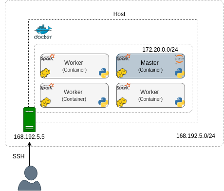

# Развертывание Spark на кластере YARN при помощи Docker

Усовик С.В. (usovik@mirea.ru)

## Содержание

- [Архитектура](#Архитектура)
    - Контейнеры
    - Образы
    - Службы
- [Установка Docker](#Установка-Docker)
- [Создание базового образа](#Создание-базового-образа)
    - Построение базового образа
    - Запуск контейнеров master и worker
    - Очистка
- [Расширение базового образа](#Расширение-базового-образа)
    - Построение образа master
    - Запуск контейнеров master и worker
    - Очистка
- [Создание кластера при помощи Docker Compose](#Создание-кластера-при-помощи-Docker-Compose)
- [Запуск приложения Spark](#Запуск-приложения-Spark)
    - Самостоятельное приложение
    - Интерактивная оболочка с Jupyter
- [Рекомендации](#Рекомендации)


## Архитектура


### Образы

<center>


<i>Рисунок 1. Образы</i></center>


### Контейнеры

<center>



<i>Рисунок 2. Контейнеры</i></center>


### Службы

<center>


<i>Рисунок 3. Демоны</i></center>

## Установка Docker

Чтобы установить Docker Engine, следуйте инструкциям на официальном сайте Docker (вот [ссылка ](https://docs.docker.com/install/linux/docker-ce/ubuntu/)) или посмотрите на это [руководство](howto_install_docker.md).
## Создание базового образа

На базовый образ должны быть установлены следующие программы и пакеты:
1. `Ubuntu 16.04` (`Python 3.5`)
2. Common Utilities: `openssh-server`, `software-properties-common`, `sudo`, `nano` etc.
3. `Hadoop 3.1.2`
4. `Spark 2.4.7`
5. Python packages: `pip`, `numpy`, `pandas` etc.

Исходный код:
- Docker-файл для сборки базового образа: [Dockerfile](../projects/docker/spark/base/Dockerfile)
- Стартовый скрипт: [entrypoint.sh](../projects/docker/spark/base/scripts/entrypoint.sh)

### Построение базового образа 

**Структура проекта**

Структура каталогов проекта базового образа:

```
base
├── config                  # configurations for Hadoop and Spark
│   ├── hdfs
│   │   ├── core-site.xml
│   │   ├── hadoop-env.sh
│   │   └── hdfs-site.xml
│   ├── mapreduce
│   │   └── mapred-site.xml
│   ├── spark
│   │   ├── spark-defaults.conf
│   │   └── spark-env.sh
│   └── yarn
│       ├── capacity-scheduler.xml
│       ├── yarn-env.sh
│       └── yarn-site.xml
├── Dockerfile              # assembling image
├── etc
│   └── requirements.txt    # python packages
├── keys
│   ├── id_rsa              # private key
│   └── id_rsa.pub          # public key
└── scripts
    └── entrypoint.sh       # starter script
```

**Docker-файл**

Docker-файла для сборки базового образа: [Dockerfile](../projects/docker/spark/base/Dockerfile)

Три ступени:
1. Загрузка и распаковка Hadoop (`hadoopBuilder`)
2. Загрузка и распаковка Spark (`sparkBuilder`)
3. Инструкция по сборке основной части базового образа (`main`)
    1. Создание пользователя `bigdata`
    2. Копирование Hadoop и Spark с предыдущих этапов
    3. Установка переменных окружения
    4. Установка системных утилит/пакетов, JDK 8 и python pip
    5. Установка пакетов Python с помощью файла `requirements`
    6. Предоставление привилегии пользователя `bigdata` для запуска службы ssh
    7. Копирование конфигурационных файлов и стартового скрипта
    8. Установка стартового скрипта в качестве точки входа (entrypoint).

**Entrypoint**

Стартовый скрипт: [entrypoint.sh](../projects/docker/spark/base/scripts/entrypoint.sh)

```bash
main()
{
    NODE_TYPE=$1
    shift

    echo "Command execution..."

    case $NODE_TYPE in
        "master") 
            init_master "$@"
            ;;
        "worker") 
            init_worker "$@"
            ;;
        *)
            echo "Error: Unsupported node type."
            exit 127
            ;;
    esac

    echo "The entrypoint script is completed."
    tail -f /dev/null
}
```

Команда для выполнения

`/bin/bash entrypoint.sh master|worker`

Инициализация Master:
1. Создание файла закрытого ключа из значения переменной окружения (при необходимости)
2. Запуск службы SSH
3. Форматирование HDFS (если необходимо)
4. Запуск служб HDFS, YARN и Spark

Инициализация Worker:
1. Создание файла открытого ключа из значения переменной среды (при необходимости)
2. Запуск службы SSH
3. Запуск служб HDFS (`datanode`) и YARN (`nodemanager`)

**Построение базового образа**

Директория для проекта spark docker:

`cd projects/docker/spark/`


Построение базового образа Spark, запустите следующую команду:

`docker build -t spark-ubuntu-base -f base/Dockerfile base`

Вывод списка образов:

`docker image ls`


### Запуск контейнеров master и worker

**Сеть**

Создание сети:

`docker network create spark-network`

**Master**

Запуск контейнера master:

```
docker run -itd \
    --name master \
    --publish 9870:9870 -p 8088:8088 -p 18080:18080 \
    --env SSH_PRIVATE_KEY="$(cat $(pwd)/base/keys/id_rsa)" \
    --hostname master \
    --network spark-network \
    spark-ubuntu-base master
```

Вывод списка запущенных контейнеров:

`docker container ls`

Проверка логов для контейнера master:

`docker container logs master`

Вы можете распечатать все процессы Java с помощью следующей команды:

`docker exec -it master jps`

Или вы можете исследовать контейнер с помощью bash:

`docker exec -it master bash`

Теперь откройте браузер и откройте dashboards HDFS и YARN: 

`localhost:9870` and `localhost:8088`

**Worker**

Следующим шагом будет запуск рабочего контейнера. Используйте следующую команду для его запуска:

```
docker run -itd \
    --name worker \
    --env SSH_PUBLIC_KEY="$(cat $(pwd)/base/keys/id_rsa.pub)" \
    --hostname worker \
    --network spark-network \
    spark-ubuntu-base worker
```

Показать список запущенных контейнеров:

`docker container ls`

Проверьте логи для контейнера master

`docker container logs worker`

Вы можете распечатать все процессы Java с помощью следующей команды:

`docker exec -it worker jps`

На dashboards, которые вы открывали ранее, вы должны заметить, что появился новый узел worker.

### Очистка

Остановим и удалим контейнеры:

`docker stop master worker && docker rm master worker`

## Расширение базового образа

Исходный код:
- Docker-файл для сборки образа master: [Dockerfile](../projects/docker/spark/master/Dockerfile)

### Построение образа master

**Структура проекта**

Структура каталогов проекта master образа:

```
master
├── config
│   └── jupyter
│       ├── jupyter_notebook_config.py  # jupyter configuration
│       └── pyspark-kernel.json         # add pyspark kernel
└── Dockerfile
```

**Docker-файл**

Docker-файл для сборки образа master: [Dockerfile](../projects/docker/spark/master/Dockerfile)

Инструкция:
1. Установка сервера jupyter notebook
2. Копирование конфигураций jupyter
3. Запуск стартового скрипта (тот же скрипт, что и раньше)

### Запуск контейнеров master и worker

Запустите контейнер master, используя новый образ master:

```
docker run -itd \
    --name master \
    --publish 9870:9870 -p 8088:8088 -p 18080:18080 -p 9999:9999 \
    --env SSH_PRIVATE_KEY="$(cat $(pwd)/base/keys/id_rsa)" \
    --hostname master \
    --network spark-network \
    spark-ubuntu-master master
```

И запускаем контейнер worker:

```
docker run -itd \
    --name worker \
    --env SSH_PUBLIC_KEY="$(cat $(pwd)/base/keys/id_rsa.pub)" \
    --hostname worker \
    --network spark-network \
    spark-ubuntu-base worker
```

Если все работает правильно, запустите сервер jupyter:

`docker exec -itd master jupyter notebook --config .jupyter/jupyter_notebook_config.py`

Теперь перейдите к `localhost:9999` и увидите стартовую страницу Jupyter. Введите пароль: `bigdata`

Создайте новый блокнот, выбрав ядро PySpark, вставьте приведенный ниже код и запустите его:

```python
import pyspark

conf = pyspark.SparkConf() \
        .setAppName("testApp") \
        .set("spark.submit.deployMode", "client") \
        .setMaster("yarn")

sc = pyspark.SparkContext(conf=conf)

data = [1, 2, 3, 4, 5]
data_rdd = sc.parallelize(data)
data_rdd.collect()

sc.stop()
```

Вы можете разделить код на несколько ячеек, если хотите.

Примечание. Spark будет запускать приложение в YARN по умолчанию, так как файл конфигурации `spark-defaults.conf`, который мы включили в базовый образ, содержит следующую строку:

```
...
spark.master		yarn 
...
```

Чтобы просмотреть текущий прогресс и историю, откройте информационные панели HDFS (`9870`), YARN (`8088`) или Spark History Server (`18080`).

Если вы остановите контейнеры командой stop, вы сохраните изменения и сможете выполнить `start` позже.

`docker stop master worker`

### Очистка

Остановите и удалите контейнеры:

`docker stop master worker && docker rm master worker`

Примечание. Если вы остановите контейнеры с помощью команды `stop`, вы сохраните изменения и сможете выполнить `start` позже. Но если вы удалите их и выполните команду `run`, вы потеряете все состояния. Итак, в этом случае вы должны использовать постоянные тома.

Удаление сети:

`docker network rm spark-network`

## Создание кластера при помощи Docker Compose

Структура проекта:
```
├── base                # base image directory
├── docker-compose.yml  # definition of multi-container environment
└── master              # master image directory
```

Файл Docker-compose для развертывания многоконтейнерной среды: [docker-compose.yml](../projects/docker/spark/docker-compose.yml)
```yaml
version: "3.7"

services:
  master:
    image: spark-ubuntu-master
    # build:          # use this option if an image doesn't exist
    #   context: .
    #   dockerfile: ./master/Dockerfile
    command: master   # argument for entrypoint script
    hostname: master
    environment: 
      - SSH_PRIVATE_KEY=${SSH_PRIVATE_KEY}
    ports:
      - "9870:9870"
      - "8088:8088"
      - "18080:18080"
      - "9999:9999"
    container_name: master
    volumes: 
      - ./data:/home/bigdata/data
      - ./app:/home/bigdata/app
  worker:
    image: spark-ubuntu-base
    # build:
    #   context: .
    #   dockerfile: ./base/Dockerfile
    command: worker
    environment: 
      - SSH_PUBLIC_KEY=${SSH_PUBLIC_KEY}
```

Чтобы собрать (при необходимости) и запустить все сервисы из compose-файла, выполните следующую команду:

```
SSH_PRIVATE_KEY="$(cat $(pwd)/base/keys/id_rsa)" \
SSH_PUBLIC_KEY="$(cat $(pwd)/base/keys/id_rsa.pub)" \
docker-compose up -d --scale worker=3
```

Параметр `scale` используется для запуска 3 workers.

Проверьте, все ли работает корректно и нет ли ошибок.

Затем запустите сервер jupyter:

`docker exec -itd master jupyter notebook --config .jupyter/jupyter_notebook_config.py`

Теперь у вас есть кластер Spark на YARN с одним master и 3 workers.

Чтобы остановить кластер, выполните команду ниже:

`docker-compose stop`

Вы также можете остановить одну или несколько служб:

`docker-compose stop [options] [SERVICE...]`

Чтобы перезапустить службы, используйте команду `start`:

`docker-compose start` или добавьте `[SERVICE...]`, чтобы указать службы

Чтобы остановить и удалить контейнеры и связанные с ними объекты докеров (например, сети), выполните следующую команду:

`docker-compose down`


## Запуск приложения Spark

### Самостоятельное приложение

```
TODO
```

### Интерактивная оболочка с Jupyter

```
TODO
```

## Рекомендации

- [Best practices for writing Dockerfiles](https://docs.docker.com/develop/develop-images/dockerfile_best-practices/)
- [How to get IP address of running docker container from host using inspect command?](https://thispointer.com/how-to-get-ip-address-of-running-docker-container-from-host-using-inspect-command/)