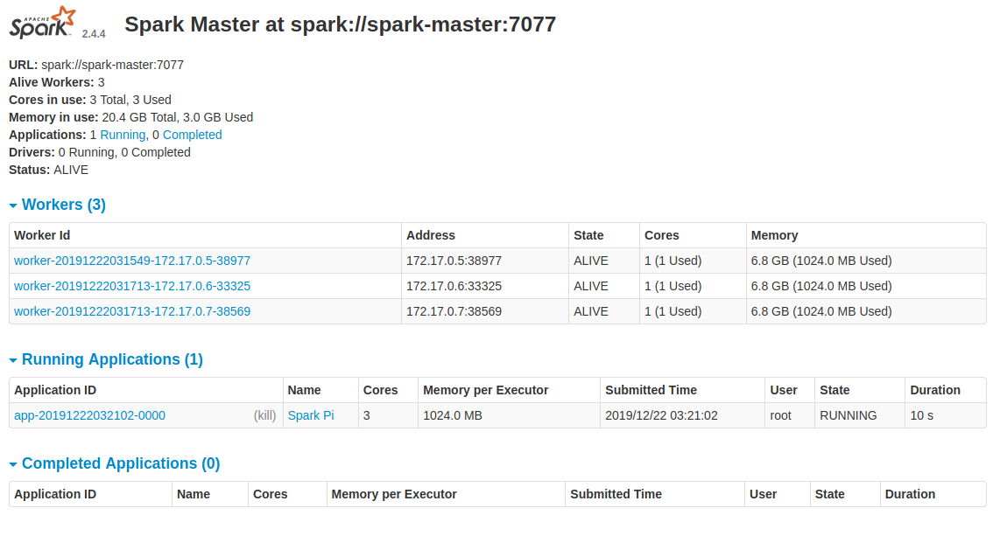

# Развертывание Spark Standalone Cluster на Kubernetes

Усовик С.В. (usovik@mirea.ru)

## Содержание

- Установка Minikube
- Построение образа Spark
- Развертывание Spark на Kubernetes
- Тест Spark Pi
- Очистка
- Рекомендации

## Требования

Для начала вам необходимо сделать следующее:
- Установите и запустите Docker. Посмотрите, как это сделать [здесь](https://docs.docker.com/install/linux/docker-ce/ubuntu/)

## Установка Minikube

Как установить инструмент `minikube` вы можете найти  [здесь](install_minikube.md).

## Запуск Kubernetes

Чтобы запустить K8S, выполните следующую команду:

`sudo minikube start --vm-driver=none`

```
😄  minikube v1.6.1 on Ubuntu 18.04 (vbox/amd64)
...
🤹  Running on localhost (CPUs=4, Memory=7974MB, Disk=60217MB) ...
...
ℹ️   OS release is Ubuntu 18.04.3 LTS
🐳  Preparing Kubernetes v1.17.0 on Docker '19.03.5' ...
    ▪ kubelet.resolv-conf=/run/systemd/resolve/resolv.conf
...
🏄  Done! kubectl is now configured to use "minikube"
```

Обратите внимание, что существуют параметры для настройки процессора и памяти, которые могут использоваться вашим кластером. Однако они не могут быть применены в режиме 'none' в driver mode.

Проверьте состояние кластера:

`sudo minikube status`

```
host: Running
kubelet: Running
apiserver: Running
kubeconfig: Configured
```

Вы можете запустить кластер позже, когда создадите образ Spark и создадите другие файлы.

## Построение образа Spark

Spark 2.3 и более поздние версии имеют Docker-файл в своем домашнем каталоге для создания образа Spark. Поэтому скачайте Spark 2.4.4 и соберите образ.

#### Скачивание дистрибутива Spark

Перейдите в домашний каталог:

```
cd $HOME
```

Скачайте Spark 2.4.4, распакуйте его и удалите исходный архив:

```
mkdir spark \
    && wget -P sources https://archive.apache.org/dist/spark/spark-2.4.4/spark-2.4.4-bin-hadoop2.7.tgz \
    && tar -xvf sources/spark-2.4.4-bin-hadoop2.7.tgz --directory spark --strip-components 1 \
    && rm sources/spark-2.4.4-bin-hadoop2.7.tgz
```

#### Построение образа Spark

Создайте образ, запустив следующий скрипт в домашнем каталоге Spark:

`cd $SPARK_HOME && bin/docker-image-tool.sh build`

```
...
Successfully built e5d13f574244
Successfully tagged spark:latest
...
Successfully built 6343567afd81
Successfully tagged spark-py:latest
...
Successfully built e20c83c11bb8
Successfully tagged spark-r:latest
```

Посмотреть все доступные изображения:

`docker image ls`

```
REPOSITORY                                TAG                 IMAGE ID            CREATED              SIZE
spark-r                                   latest              e20c83c11bb8        About a minute ago   760MB
spark-py                                  latest              6343567afd81        5 minutes ago        466MB
spark                                     latest              e5d13f574244        6 minutes ago        375MB
```

Docker-файл и скрипт entrypoint можно найти здесь: `$SPARK_HOME/spark/kubernetes/dockerfiles/spark`.

#### Изменение исходного образа 

Чтобы развернуть Spark в Kubernetes с помощью версии развертывания, нам нужно немного изменить созданный образ, чтобы применить собственный сценарий entrypoint. Этот образ будет использоваться для запуска узлов Spark master и workers.

Есть два основных скрипта: первый для запуска контейнеров и второй для их остановки.

Стартовый скрипт выглядит следующим образом:

```bash
#!/bin/bash

case "$1" in
    master)
        echo "MASTER"
        exec tini -s -- /opt/spark/bin/spark-class org.apache.spark.deploy.master.Master --host $HOSTNAME --port 7077 --webui-port 8080
        ;;
    worker)
        echo "WORKER"
        MASTER_IP_ADDRESSES=( $( nslookup $MASTER_IP_RESOLVER | awk '/^Address / { print $3 }') )
        if [ ${#MASTER_IP_ADDRESSES[@]} ] && [ -n ${MASTER_IP_ADDRESSES[0]} ]; 
        then
            echo ${MASTER_IP_ADDRESSES[0]} $MASTER_HOSTNAME >> /etc/hosts
            exec tini -s -- /opt/spark/bin/spark-class org.apache.spark.deploy.worker.Worker spark://$MASTER_HOSTNAME:7077
        else
            echo "Master IP was not found" 1>&2
            exit 1
        fi
        ;;
    *)
        echo $"Usage: $0 {master|worker}" 1>&2
        exit 1
esac
```

Теперь создайте Dockerfile со следующим содержимым:

```dockerfile
FROM spark:latest

LABEL maintainer="Sergei Papulin <papulin.study@yandex.ru>"

ENV PATH="$SPARK_HOME/bin:${PATH}"
COPY ["./start-spark.sh", "./stop-spark.sh", "/opt/"]
RUN chmod 755 /opt/start-spark.sh /opt/stop-spark.sh
```

Создайте собственный образ Spark, используя созданный Docker-файл:

`cd $REPO/projects/k8s/spark/ && docker build -t custom-spark:v2.4.4 .`

```
Sending build context to Docker daemon  11.26kB
Step 1/5 : FROM spark:latest
 ---> e5d13f574244
Step 2/5 : LABEL maintainer="Sergei Papulin <papulin.study@yandex.ru>"
 ---> Running in 9de96c753974
Removing intermediate container 9de96c753974
 ---> 050bb6981f5e
Step 3/5 : ENV PATH="$SPARK_HOME/bin:${PATH}"
 ---> Running in e05dc93b02fd
Removing intermediate container e05dc93b02fd
 ---> 80882ed1ba66
Step 4/5 : COPY ["./start-spark.sh", "./stop-spark.sh", "/opt/"]
 ---> 1fc7c09a9537
Step 5/5 : RUN chmod 755 /opt/start-spark.sh /opt/stop-spark.sh
 ---> Running in 84a3537e2867
Removing intermediate container 84a3537e2867
 ---> 66e2167651e5
Successfully built 66e2167651e5
Successfully tagged custom-spark:v2.4.4
```

Вывод списка образов:

`docker image ls`

```
REPOSITORY                                TAG                 IMAGE ID            CREATED             SIZE
custom-spark                              v2.4.4              66e2167651e5        34 seconds ago      375MB
spark-r                                   latest              e20c83c11bb8        10 minutes ago      760MB
spark-py                                  latest              6343567afd81        14 minutes ago      466MB
spark                                     latest              e5d13f574244        16 minutes ago      375MB
```

Вы можете запустить интерпретатор bash в пользовательском образе и проверить, что все скрипты успешно скопированы:

`docker run --name custom-spark-test -it custom-spark:v2.4.4 /bin/bash`

```
bash-4.4# ls /opt/
entrypoint.sh   spark           start-spark.sh  stop-spark.sh
bash-4.4# exit
```

Удалите контейнер, в котором был запущен пользовательский образ.

Выведите последний контейнер:

`docker container ls -l`

```
CONTAINER ID        IMAGE                 COMMAND                  CREATED             STATUS                     PORTS               NAMES
7634f6045524        custom-spark:v2.4.4   "/opt/entrypoint.sh …"   3 minutes ago       Exited (0) 2 minutes ago                       custom-spark-test
```

Удалите его по идентификатору контейнера:

`docker container rm 7634f6045524`

## Развертывание Spark в Kubernetes

Чтобы развернуть Spark, давайте создадим два файла развертывания yaml для запуска master и worker узлов. Файлы развертывания содержат инструкции по развертыванию модулей декларативным способом.

Кроме того, мы создаем yaml-файл службы, чтобы открыть основной порт пользовательского веб-интерфейса, и используем механизм обнаружения для получения основного IP-адреса в workers.

#### Развертывание файла Master

```yaml
apiVersion: apps/v1
kind: Deployment
metadata:
  name: spark-master-deployment
  namespace: spark
  labels:
    environment: dev
    app: spark
    role: master
    version: 2.4.4
spec:
  replicas: 1
  selector:
    matchLabels:
      app: spark
      role: master
  template:
    metadata:
      labels:
        app: spark
        role: master
    spec:
      hostname: spark-master
      containers:
        - name: spark-master
          image: custom-spark:v2.4.4
          imagePullPolicy: IfNotPresent
          command: ["/opt/start-spark.sh"]
          args: ["master"]
          ports:
            - containerPort: 7077
            - containerPort: 8080
          resources:
            requests:
              cpu: 500m
          lifecycle:
            preStop:
              exec:
                command: ["/opt/stop-spark.sh", "master"]
```

#### Развертывание файла Worker

```yaml
apiVersion: apps/v1
kind: Deployment
metadata:
  name: spark-worker-deployment
  namespace: spark
  labels:
    environment: dev
    app: spark
    role: worker
    version: 2.4.4
spec:
  replicas: 1
  selector:
    matchLabels:
      app: spark
      role: worker
  template:
    metadata:
      labels:
        app: spark
        role: worker
    spec:
      containers:
        - name: spark-worker
          image: custom-spark:v2.4.4
          imagePullPolicy: IfNotPresent
          env:
            - name: MASTER_IP_RESOLVER
              value: "*.spark-master-service.spark.svc.cluster.local"
            - name: MASTER_HOSTNAME
              value: "spark-master"
          command: ["/opt/start-spark.sh"]
          args: ["worker"]
          resources:
            requests:
              cpu: 500m
          lifecycle:
            preStop:
              exec:
                command: ["/opt/stop-spark.sh", "worker"]
```

#### Службы

```yaml
apiVersion: v1
kind: Service
metadata:
  name: spark-master-service
  namespace: spark
  labels:
    environment: dev
    app: spark
    role: master
    version: 2.4.4
spec:
  selector:
    app: spark
    role: master
  ports:
    - protocol: TCP
      port: 9999
      targetPort: 8080
```


#### Выполнение развертывания и служебных файлов

Если вы еще не запускали K8S, самое время это сделать.

Создайте пространство имен `spark`:

`sudo kubectl create namespace spark`

```
namespace/spark created
```

Сначала запустите службу:

`sudo kubectl apply -f $REPO/projects/k8s/spark/spark-master-service.yaml`

```
service/spark-master-service created
```

Вывести все сервисы из пространства имен `spark`:

`sudo kubectl get services -n spark`

```
NAME                   TYPE        CLUSTER-IP     EXTERNAL-IP   PORT(S)    AGE
spark-master-service   ClusterIP   10.96.66.194   <none>        9999/TCP   12s
```

Затем выполните развертывание master:

`sudo kubectl apply -f $REPO/projects/k8s/spark/spark-master-deployment.yaml`

```
deployment.apps/spark-master-deployment created
```

И развертывание worker:

`sudo kubectl apply -f $REPO/projects/k8s/spark/spark-worker-deployment.yaml`

```
deployment.apps/spark-worker-deployment created
```

`sudo kubectl get deployments -n spark`

```
NAME                      READY   UP-TO-DATE   AVAILABLE   AGE
spark-master-deployment   1/1     1            1           21s
spark-worker-deployment   1/1     1            1           11s
```

Отобразить все запущенные модули в пространстве имен `spark`:

`sudo kubectl get pods -n spark -o wide`

```
NAME                                       READY   STATUS    RESTARTS   AGE   IP           NODE       NOMINATED NODE   READINESS GATES
spark-master-deployment-85b688cfbb-mbznc   1/1     Running   0          37s   172.17.0.4   minikube   <none>           <none>
spark-worker-deployment-5dfd4b788d-5ghfq   1/1     Running   0          26s   172.17.0.5   minikube   <none>           <none>
```

Чтобы получить журналы из master модуля, вы можете запустить следующую команду:

`sudo kubectl logs spark-master-deployment-85b688cfbb-mbznc -n spark`

```
MASTER
Using Spark's default log4j profile: org/apache/spark/log4j-defaults.properties
INFO Master: Started daemon with process name: 6@spark-master
...
INFO Utils: Successfully started service 'sparkMaster' on port 7077.
INFO Master: Starting Spark master at spark://spark-master:7077
INFO Master: Running Spark version 2.4.4
INFO Utils: Successfully started service 'MasterUI' on port 8080.
INFO MasterWebUI: Bound MasterWebUI to 0.0.0.0, and started at http://spark-master:8080
INFO Master: I have been elected leader! New state: ALIVE
```

Вы можете запустить `bash` так же, как и для контейнера Docker:

`sudo kubectl exec -it spark-master-deployment-85b688cfbb-mbznc -n spark -- /bin/bash`

#### Масштабирование workers

AКак вы могли заметить, у нас работает только один worker. Чтобы увеличить количество worker до 3, выполните следующую команду с параметром `replicas`, равным 3:

`sudo kubectl scale deployment.v1.apps/spark-worker-deployment --replicas=3 -n spark`

```
deployment.apps/spark-worker-deployment scaled
```

Теперь отобразите все worker модули:

`sudo kubectl get pods -l app=spark,role=worker -o wide -n spark`

```
NAME                                       READY   STATUS    RESTARTS   AGE   IP           NODE       NOMINATED NODE   READINESS GATES
spark-worker-deployment-5dfd4b788d-5ghfq   1/1     Running   0          94s   172.17.0.5   minikube   <none>           <none>
spark-worker-deployment-5dfd4b788d-q94p5   1/1     Running   0          10s   172.17.0.6   minikube   <none>           <none>
spark-worker-deployment-5dfd4b788d-qc4f2   1/1     Running   0          10s   172.17.0.7   minikube   <none>           <none>
```

Откройте браузер и перейдите по адресу `10.96.66.194:9999` (см. IP-адрес службы), чтобы увидеть основной веб-интерфейс:

<center><i>Рисунок 1. Spark Master Web UI</i></center>

## Запуск Pi теста

Простой способ протестировать наш кластер Spark — запустить стандартное приложение Pi, которое находится в каталоге `examples`:

```
sudo kubectl exec spark-master-deployment-85b688cfbb-mbznc -n spark -- \
  spark-submit \
    --master spark://spark-master:7077 \
    --name spark-pi \
    --class org.apache.spark.examples.SparkPi \
    local:///opt/spark/examples/jars/spark-examples_2.11-2.4.4.jar
```

```
...
INFO DAGScheduler: Job 0 finished: reduce at SparkPi.scala:38, took 6.191359 s
Pi is roughly 3.137515687578438
INFO SparkUI: Stopped Spark web UI at http://spark-master:4040
INFO StandaloneSchedulerBackend: Shutting down all executors
...
```


<center><i>Рисунок 2. Запуск приложения</i></center>


<center><i>Рисунок 3. Сведения о приложении</i></center>

## Очистка

Чтобы удалить развертывания с их модулями, выполните следующую команду:

`sudo kubectl delete deployment spark-worker-deployment spark-master-deployment -n spark`

```
deployment.apps "spark-worker-deployment" deleted
deployment.apps "spark-master-deployment" deleted
```

Удаление службы:

`sudo kubectl delete service spark-master-service -n spark`

```
service "spark-master-service" deleted
```

Остановка кластера:

`sudo minikube stop`

```
✋  Stopping "minikube" in none ...
✋  Stopping "minikube" in none ...
🛑  "minikube" stopped.
```

Удаление кластера:

`sudo minikube delete`

```
🔄  Uninstalling Kubernetes v1.17.0 using kubeadm ...
🔥  Deleting "minikube" in none ...
💔  The "minikube" cluster has been deleted.
🔥  Successfully deleted profile "minikube"
```


## Рекомендации

- [Kubernetes: Deployments](https://kubernetes.io/docs/concepts/workloads/controllers/deployment/)
- [Kubernetes: Service](https://kubernetes.io/docs/concepts/services-networking/service/)
- [Deploying Spark on Kubernetes](https://github.com/testdrivenio/spark-kubernetes)

