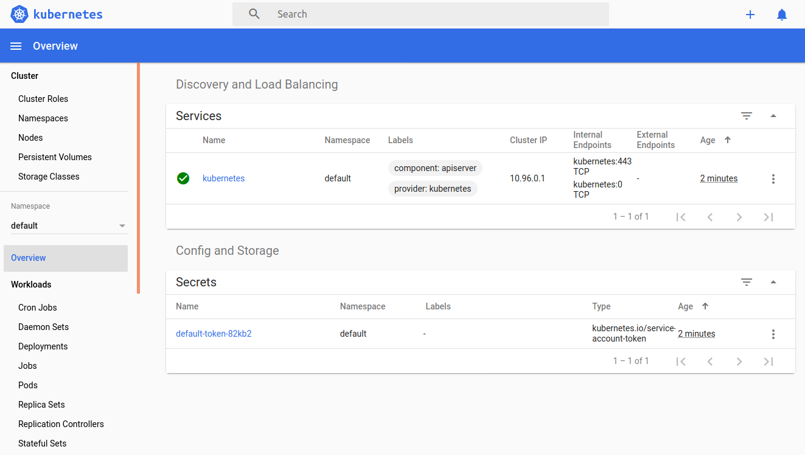

# Spark на Kubernetes: spark-submit

Усовик С.В. (usovik@mirea.ru)

## Содержание

- Установка Minikube
- Построение образа Spark
- Запуск приложения Spark на Kubernetes
- Поиск неисправностей
- Очистка
- Рекомендации

## Требования

Для начала вам необходимо сделать следующее:
- Установить и запустить Docker. Посмотрите, как это сделать [здесь](https://docs.docker.com/install/linux/docker-ce/ubuntu/)


## Установка minikube

Как установить инструмент `minikube` вы можете найти [здесь](install_minikube.md).

## Запуск Kubernetes

Чтобы запустить K8S, выполните следующую команду:

`sudo minikube start --vm-driver=none`

```
😄  minikube v1.6.1 on Ubuntu 18.04 (vbox/amd64)
...
🤹  Running on localhost (CPUs=4, Memory=7974MB, Disk=60217MB) ...
...
ℹ️   OS release is Ubuntu 18.04.3 LTS
🐳  Preparing Kubernetes v1.17.0 on Docker '19.03.5' ...
    ▪ kubelet.resolv-conf=/run/systemd/resolve/resolv.conf
...
🏄  Done! kubectl is now configured to use "minikube"
```

Обратите внимание, что существуют параметры для настройки процессора и памяти, которые могут использоваться вашим кластером. Однако, они не могут быть применены в 'none' в driver mode.

Проверьте состояние кластера:

`sudo minikube status`

```
host: Running
kubelet: Running
apiserver: Running
kubeconfig: Configured
```

Вы можете запустить кластер позже, когда создадите образ Spark и создадите другие файлы.

## Построение образа Spark

Spark 2.3 и более поздние версии имеют Docker-файл в своем домашнем каталоге для создания образа Spark. Поэтому скачайте Spark 2.4.4 и соберите образ.

#### Скачивание дистрибутива Spark

Перейдите в домашний каталог:

```
cd $HOME
```

Скачайте Spark 2.4.4, распакуйте его и удалите исходный архив:

```
mkdir spark \
    && wget -P sources https://archive.apache.org/dist/spark/spark-2.4.4/spark-2.4.4-bin-hadoop2.7.tgz \
    && tar -xvf sources/spark-2.4.4-bin-hadoop2.7.tgz --directory spark --strip-components 1 \
    && rm sources/spark-2.4.4-bin-hadoop2.7.tgz
```

#### Построение образа Spark

Создайте образ, запустив следующий скрипт в домашнем каталоге Spark:

`cd $SPARK_HOME && bin/docker-image-tool.sh build`

```
...
Successfully built e5d13f574244
Successfully tagged spark:latest
...
Successfully built 6343567afd81
Successfully tagged spark-py:latest
...
Successfully built e20c83c11bb8
Successfully tagged spark-r:latest
```

Вывести все доступные образы:

`docker image ls`

```
REPOSITORY                                TAG                 IMAGE ID            CREATED              SIZE
spark-r                                   latest              e20c83c11bb8        About a minute ago   760MB
spark-py                                  latest              6343567afd81        5 minutes ago        466MB
spark                                     latest              e5d13f574244        6 minutes ago        375MB
```

Docker-файл и скрипт entrypoint можно найти здесь: `$SPARK_HOME/spark/kubernetes/dockerfiles/spark`.

Вы можете запустить интерпретатор bash в пользовательском образе и проверить, что все скрипты успешно выполнены:

`docker run --name spark-test -it spark:latest /bin/bash`

```
bash-4.4# ls /opt/
entrypoint.sh   spark
bash-4.4# exit
```

## Конфигурация Kubernetes

Создайте пространство имен `spark`, чтобы отличать ресурсы для нашего кластера от других:

`sudo kubectl create namespace spark`

```
namespace/spark created
```

Создайте учетную запись службы с именем `spark-serviceaccount`:

`sudo kubectl create serviceaccount spark-serviceaccount --namespace spark`

```
serviceaccount/spark-serviceaccount created
```

Привяжите роль `edit` к `spark-serviceaccount`:

`sudo kubectl create rolebinding spark-rolebinding --clusterrole=edit --serviceaccount=spark:spark-serviceaccount --namespace=spark`

```
rolebinding.rbac.authorization.k8s.io/spark-rolebinding created
```

Запустите веб-интерфейс Kubernetes в другом терминале:

`sudo minikube dashboard`

```
🤔  Verifying dashboard health ...
🚀  Launching proxy ...
🤔  Verifying proxy health ...
http://127.0.0.1:42625/api/v1/namespaces/kubernetes-dashboard/services/http:kubernetes-dashboard:/proxy/
```


<center><i>Рисунок 1. Kubernetes Web UI</i></center><br>


## Запуск приложения Spark на Kubernetes

#### Требования

Чтобы запустить приложение Spark с помощью команды `spark-submit`, на вашем хосте обязательно должен быть дистрибутив Spark. Кроме того, у вас должна быть совместимая версия Java, в данном случае 8.

Проверьте текущую версию Java:

`java -version`

```
openjdk version "1.8.0_232"
OpenJDK Runtime Environment (build 1.8.0_232-8u232-b09-0ubuntu1~18.04.1-b09)
OpenJDK 64-Bit Server VM (build 25.232-b09, mixed mode)
```

Если у вас более старая версия Java, выполните следующие команды для настройки Java 8:

`sudo add-apt-repository ppa:openjdk-r/ppa && sudo apt update && sudo apt -y install openjdk-8-jdk`


#### Запуск приложения

*Cluster mode*

Запустите команду ниже, чтобы запустить приложение Spark Pi:

```
sudo $SPARK_HOME/bin/spark-submit \
    --master k8s://https://localhost:8443 \
    --deploy-mode cluster \
    --name spark-pi \
    --class org.apache.spark.examples.SparkPi \
    --conf spark.executor.instances=3 \
    --conf spark.kubernetes.container.image=spark \
    --conf spark.kubernetes.namespace=spark \
    --conf spark.kubernetes.authenticate.driver.serviceAccountName=spark-serviceaccount \
    local:///opt/spark/examples/jars/spark-examples_2.11-2.4.4.jar
```

Откройте другой терминал и распечатайте все модули в пространстве имен `spark`:

`sudo kubectl get pods -n spark -o wide`

```
NAME                            READY   STATUS    RESTARTS   AGE   IP           NODE       NOMINATED NODE   READINESS GATES
spark-pi-1577001982580-driver   1/1     Running   0          24s   172.17.0.6   minikube   <none>           <none>
spark-pi-1577001982580-exec-1   1/1     Running   0          10s   172.17.0.8   minikube   <none>           <none>
spark-pi-1577001982580-exec-2   1/1     Running   0          10s   172.17.0.7   minikube   <none>           <none>
spark-pi-1577001982580-exec-3   0/1     Pending   0          10s   <none>       <none>     <none>           <none>
```

Подождите немного, пока приложение завершит обработку, и повторите предыдущую команду:

```
NAME                            READY   STATUS      RESTARTS   AGE   IP           NODE       NOMINATED NODE   READINESS GATES
spark-pi-1577001982580-driver   0/1     Completed   0          52s   172.17.0.6   minikube   <none>           <none>
```

Вы должны увидеть вывод приложения, аналогичный приведенному ниже:

```
INFO LoggingPodStatusWatcherImpl: State changed, new state: 
         pod name: spark-pi-1577001982580-driver
         namespace: spark
         ...
         phase: Pending
         ...
INFO LoggingPodStatusWatcherImpl: State changed, new state: 
         pod name: spark-pi-1577001982580-driver
         namespace: spark
         ...
         phase: Pending
         ...
INFO Client: Waiting for application spark-pi to finish...
INFO LoggingPodStatusWatcherImpl: State changed, new state: 
         pod name: spark-pi-1577001982580-driver
         namespace: spark
         ...
         phase: Running
         ...
INFO LoggingPodStatusWatcherImpl: State changed, new state: 
         pod name: spark-pi-1577001982580-driver
         namespace: spark
         ...
         phase: Succeeded
         ...
INFO LoggingPodStatusWatcherImpl: Container final statuses:

         Container name: spark-kubernetes-driver
         Container image: spark:latest
         Container state: Terminated
         Exit code: 0
INFO Client: Application spark-pi finished.

```

Получить журналы драйверов следующим образом:

`sudo kubectl logs spark-pi-1577001982580-driver --namespace spark`

Если все прошло хорошо, вы найдете следующую строку:

```
Pi is roughly 3.1426957134785676
```

Если у вас возникла ошибка в драйвере, как показано ниже, вам необходимо заменить jar-файлы Kubernetes. Перейдите к следующему разделу по устранению неполадок этого руководства, чтобы исправить ошибку.

```
INFO SparkUI: Bound SparkUI to 0.0.0.0, and started at http://spark-pi-1577001982580-driver-svc.spark.svc:4040
INFO SparkContext: Added JAR file:///opt/spark/examples/jars/spark-examples_2.11-2.4.4.jar at spark://spark-pi-1577001982580-driver-svc.spark.svc:7078/jars/spark-examples_2.11-2.4.4.jar with timestamp 1576677527031
INFO ExecutorPodsAllocator: Going to request 3 executors from Kubernetes.
WARN WatchConnectionManager: Exec Failure: HTTP 403, Status: 403 - 
java.net.ProtocolException: Expected HTTP 101 response but was '403 Forbidden'
        at okhttp3.internal.ws.RealWebSocket.checkResponse(RealWebSocket.java:216)
        at okhttp3.internal.ws.RealWebSocket$2.onResponse(RealWebSocket.java:183)
        at okhttp3.RealCall$AsyncCall.execute(RealCall.java:141)
        at okhttp3.internal.NamedRunnable.run(NamedRunnable.java:32)
        at java.util.concurrent.ThreadPoolExecutor.runWorker(ThreadPoolExecutor.java:1149)
        at java.util.concurrent.ThreadPoolExecutor$Worker.run(ThreadPoolExecutor.java:624)
        at java.lang.Thread.run(Thread.java:748)
```

Вы можете отслеживать статус своего приложения в веб-интерфейсе Kubernetes.


<center><i>Рисунок 2. Сведения о приложении</i></center><br>

*Client mode*

Приложение Spark можно запустить в режиме `клиент`. В этом случае вы должны предоставить jar-файл вашего приложения, расположенный на хосте (в отличие от режима `cluster`, где jar-файлы должны быть в контейнерах с префиксом `local://`).

```
sudo $SPARK_HOME/bin/spark-submit \
    --master k8s://https://localhost:8443 \
    --deploy-mode client \
    --name spark-pi \
    --class org.apache.spark.examples.SparkPi \
    --conf spark.executor.instances=3 \
    --conf spark.kubernetes.container.image=spark \
    --conf spark.kubernetes.namespace=spark \
    --conf spark.kubernetes.authenticate.driver.serviceAccountName=spark-serviceaccount \
    file:///$SPARK_HOME/examples/jars/spark-examples_2.11-2.4.4.jar
```

`sudo kubectl get pods -n spark -o wide`

```
spark-pi-1577006053868-exec-1   1/1     Running     0          14s   172.17.0.6   minikube   <none>           <none>
spark-pi-1577006055295-exec-2   1/1     Running     0          13s   172.17.0.7   minikube   <none>           <none>
spark-pi-1577006055387-exec-3   1/1     Running     0          13s   172.17.0.8   minikube   <none>           <none>
```

```
INFO DAGScheduler: ResultStage 0 (reduce at SparkPi.scala:38) finished in 1.496 s
INFO DAGScheduler: Job 0 finished: reduce at SparkPi.scala:38, took 1.702189 s
Pi is roughly 3.1458157290786453
INFO KubernetesClusterSchedulerBackend: Shutting down all executors
```

## Поиск неисправностей


#### Заменa jar-файлjd Kubernetes

Если у вас возникла ошибка в драйвере, как показано ниже, вам необходимо заменить jar-файлы Kubernetes.

```
INFO SparkUI: Bound SparkUI to 0.0.0.0, and started at http://spark-pi-1577001982580-driver-svc.spark.svc:4040
INFO SparkContext: Added JAR file:///opt/spark/examples/jars/spark-examples_2.11-2.4.4.jar at spark://spark-pi-1577001982580-driver-svc.spark.svc:7078/jars/spark-examples_2.11-2.4.4.jar with timestamp 1576677527031
INFO ExecutorPodsAllocator: Going to request 3 executors from Kubernetes.
WARN WatchConnectionManager: Exec Failure: HTTP 403, Status: 403 - 
java.net.ProtocolException: Expected HTTP 101 response but was '403 Forbidden'
        at okhttp3.internal.ws.RealWebSocket.checkResponse(RealWebSocket.java:216)
        at okhttp3.internal.ws.RealWebSocket$2.onResponse(RealWebSocket.java:183)
        at okhttp3.RealCall$AsyncCall.execute(RealCall.java:141)
        at okhttp3.internal.NamedRunnable.run(NamedRunnable.java:32)
        at java.util.concurrent.ThreadPoolExecutor.runWorker(ThreadPoolExecutor.java:1149)
        at java.util.concurrent.ThreadPoolExecutor$Worker.run(ThreadPoolExecutor.java:624)
        at java.lang.Thread.run(Thread.java:748)
```

Это известная проблема, которая описана [здесь](https://andygrove.io/2019/08/apache-spark-regressions-eks/).

Замените следующие файлы более поздней версией 4.4.2:

- `$SPARK_HOME/jars/kubernetes-client-4.1.2.jar`
- `$SPARK_HOME/jars/kubernetes-model-4.1.2.jar`
- `$SPARK_HOME/jars/kubernetes-model-common-4.1.2.jar`

Вот скрипт bash для этого:

```bash
# Back up the old version of the kubernetes files
mkdir -p spark/jars_k8s_old && mv spark/jars/kuber* $_

LIB_VERSION="4.4.2"
REPO=https://search.maven.org/remotecontent?filepath=io/fabric8
JAR_DIR=/home/bigdata/spark/jars

# List of files to download
FileArray=("kubernetes-client"  "kubernetes-model"  "kubernetes-model-common")

# Download the files and set the default permission to them
for file in ${FileArray[*]}; do
    wget -O $JAR_DIR/$file-$LIB_VERSION.jar $REPO/$file/$LIB_VERSION/$file-$LIB_VERSION.jar && chmod 644 $JAR_DIR/$file-$LIB_VERSION.jar
done
```

Если вы не хотите создавать файл сценария bash, вы можете запустить его в терминале следующим образом:

```
bash -c 'YOUR_CODE'
```

## Очистка

Удалите модуль драйвера в пространстве имен `spark`:

`sudo /opt/k8s/kubectl delete pod spark-pi-1577001982580-driver --namespace spark`

Удалите службу:

`sudo /opt/k8s/kubectl delete service spark-pi-1577001982580-driver-svc -n spark`

Остановите кластер:

`sudo /opt/k8s/minikube stop`

```
✋  Stopping "minikube" in none ...
✋  Stopping "minikube" in none ...
🛑  "minikube" stopped.
```

Удалите кластер:

`sudo /opt/k8s/minikube delete`

```
🔄  Uninstalling Kubernetes v1.17.0 using kubeadm ...
🔥  Deleting "minikube" in none ...
💔  The "minikube" cluster has been deleted.
🔥  Successfully deleted profile "minikube"
```


## Рекомендации

- [Running Spark on Kubernetes](https://spark.apache.org/docs/2.4.4/running-on-kubernetes.html)
- [Quick Start Guide — Submit Spark (2.4) Jobs on Minikube/AWS](https://medium.com/@aelbuni/apache-spark-2-4-3-running-jobs-in-kubernetes-cluster-ebd7a28b99cd)
- [EKS security patches cause Apache Spark jobs to fail with permissions error](https://andygrove.io/2019/08/apache-spark-regressions-eks/)
- [Kubernetes Dashboard](https://github.com/kubernetes/dashboard)
- [Web UI (Dashboard)](https://kubernetes.io/docs/tasks/access-application-cluster/web-ui-dashboard/)
- [Creating sample user](https://github.com/kubernetes/dashboard/blob/master/docs/user/access-control/creating-sample-user.md)

